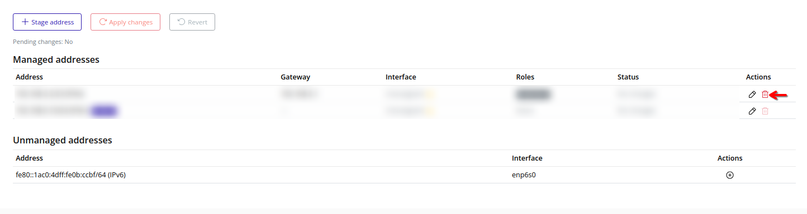
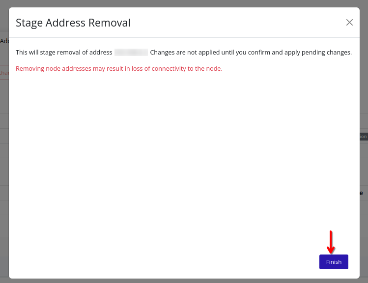
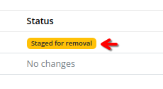

# Delete (Stage) An Address
Stage the removal of a managed address from the node. The default address cannot be removed.

> [!NOTE]
> Deleting a staged address becomes permanent once the staged changes are applied and cannot be undone. Until then, you can undo the staged removal of a managed address by opening **Stage Address Update** for that address and clicking **Finish** to unstage the removal.

> [!NOTE]
> Staged removals are pending until you [Apply Changes](./apply.md).

## Web Interface
1. Click the trash icon next to the address under **Managed addresses**.
    

2. Review the confirmation dialog and click **Finish** to stage the removal.
    

3. A badge "Staged for removal" will appear next to the address in the list.
    