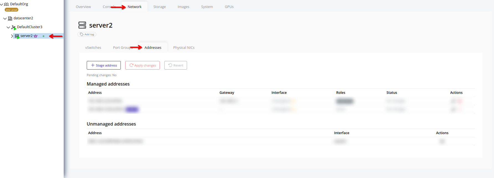

# List Node Addresses
View managed and staged addresses for a node.

> [!NOTE]
> Pending changes are visible here, but are not applied until you [Apply Changes](./apply.md).

## Web Interface
1. Select a node in the navigation tree.

2. Select the **Network** tab.

3. Select the **Addresses** subtab. Both managed and staged addresses are listed.
    
