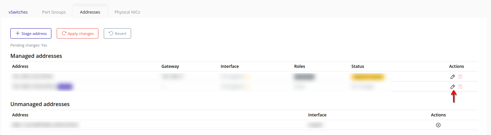
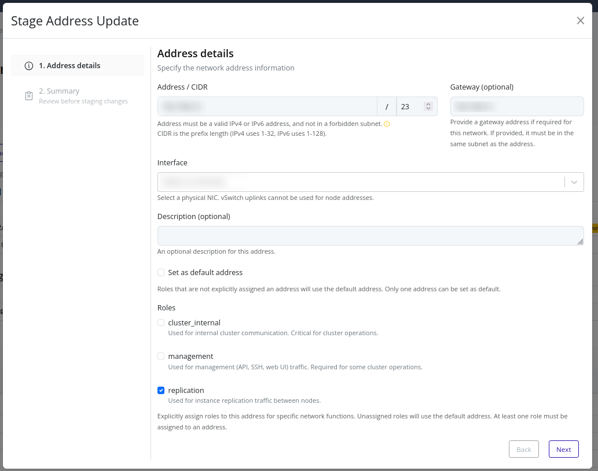
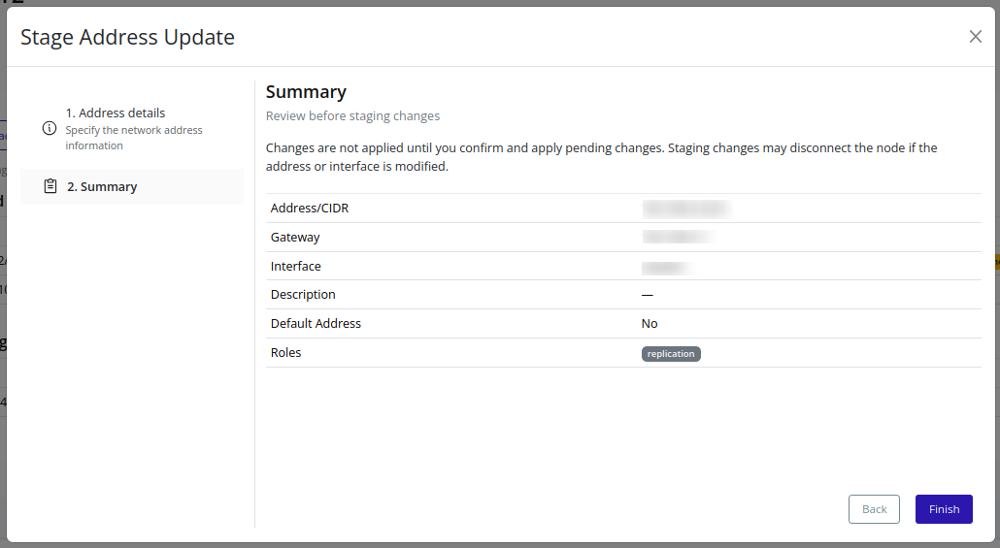

# Update (Stage) An Address
Stage changes to an existing address, including role assignments and gateway settings.

> [!NOTE]
> Updating a staged or existing address is pending until you [Apply Changes](./apply.md).

> [!TIP]
> To unstage removal of an existing address, edit the address and click **Finish** without making changes.

## Web Interface
1. In **Managed addresses**, click the edit icon.
    

2. Update fields or role assignments.
    

3. Review the summary and click **Finish**.
    

For additional field details, see [Create a New Address](./create.md).
