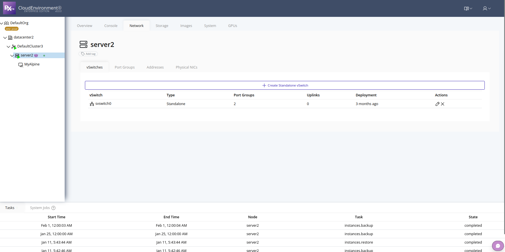

# Network Management

Networking in Pextra Cloud Environment® is managed at the **node (server) level**. Each node includes **physical NICs** that can be virtualized to create **virtual networks** for your instances, providing flexibility and isolation in your deployment.

## Accessing Node Networking

1. In the **left navigation panel**, click on the desired node.
2. In the **right panel**, select the **Network** tab.

## Manage Network Components

From the Network tab, you can configure:

- **vSwitches** – Create and manage virtual switches to connect virtual machines.
- **Port Groups** – Define network segments and VLANs for instance traffic.
- **NICs** – Assign physical NICs to virtual switches or manage virtual NICs.

> [!TIP]
> Plan your network topology, including VLANs and port groups, **before assigning NICs**. Proper planning ensures optimal connectivity, isolation, and performance across your instances.
