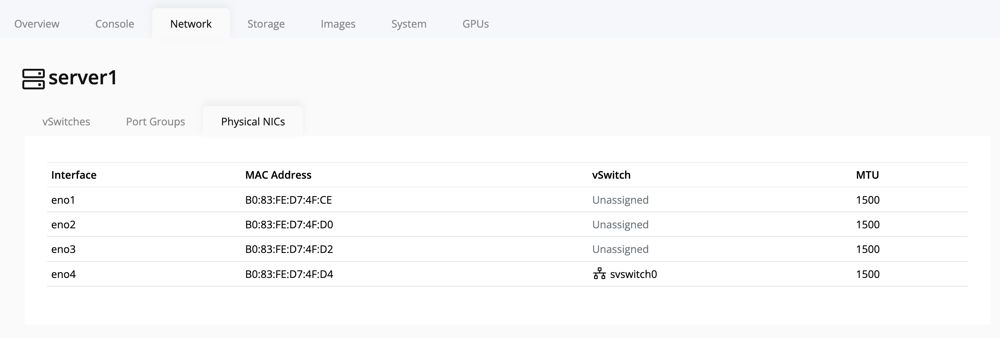

# Viewing Available NICs on a Node

To view the network interface cards (NICs) available on a node:

1. In the **left navigation panel**, click on the **node** you want to inspect.
2. Select the **Network** tab on the node's details page.
3. Click on **NICs**.
4. The page will display all available NICs for the selected node.

   