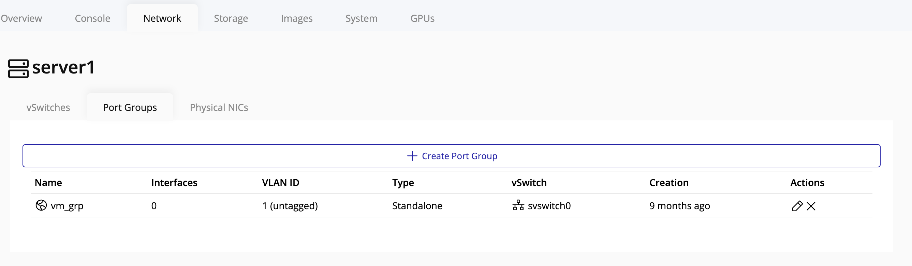
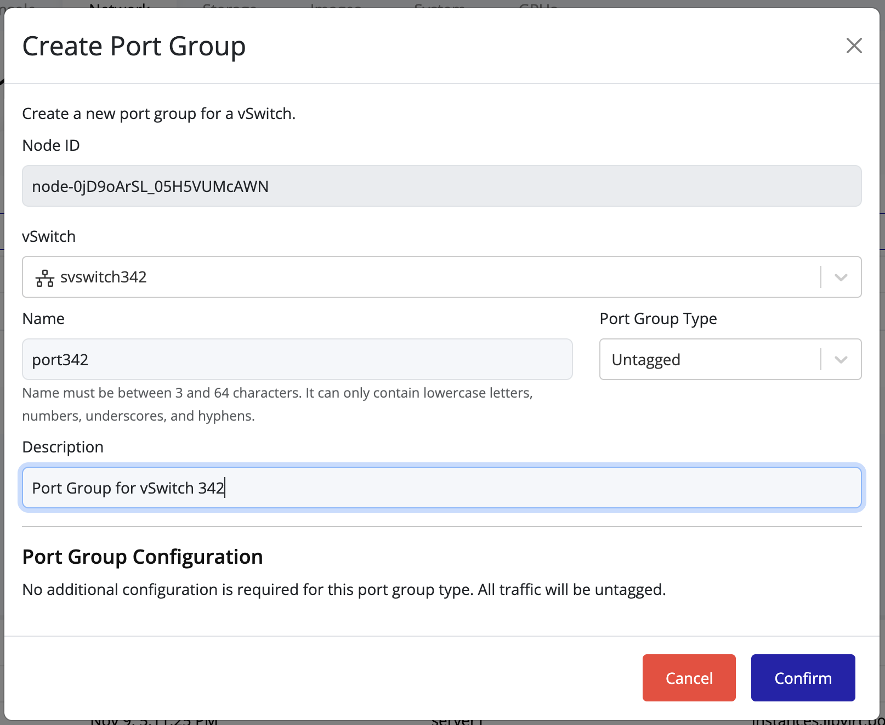
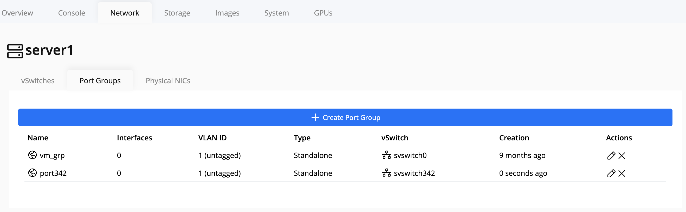

## Creating and Managing Port Groups

Port groups define how virtual machines connect to a vSwitch and access the physical network.  
Each port group is associated with a specific vSwitch and can include custom network configurations.

### Creating a Port Group

1. Select the **node** in the left navigation panel.
2. Click the **Network** tab on the right.
3. Open the **Ports** tab to view existing port groups.

   

4. Click the **Create Port Group** button at the top of the page.

   

5. In the creation form:
    - Select the **vSwitch** to associate the new port group with.
    - Fill in the remaining configuration fields as needed (for example: VLAN ID, description, or security settings).
    - Click **Confirm** to save.

   

> [!TIP]
> When managing multiple networks, naming port groups clearly (e.g., *Production*, *Backup*, *DMZ*) makes maintenance and troubleshooting much easier.
