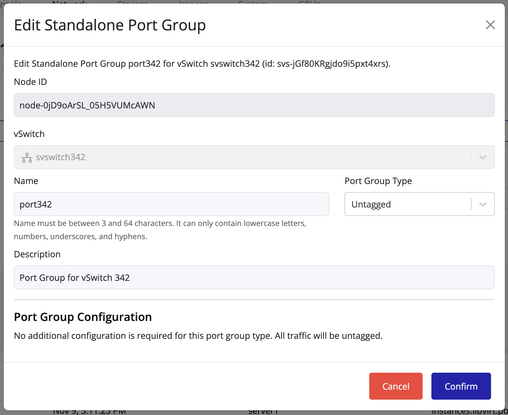

## Editing a Port Group

To modify an existing port group:

1. Locate the desired port group in the list.
2. Click the **Edit** icon in the same row.

3. Adjust the configuration fields as needed.
4. Click **Confirm** to apply the changes.