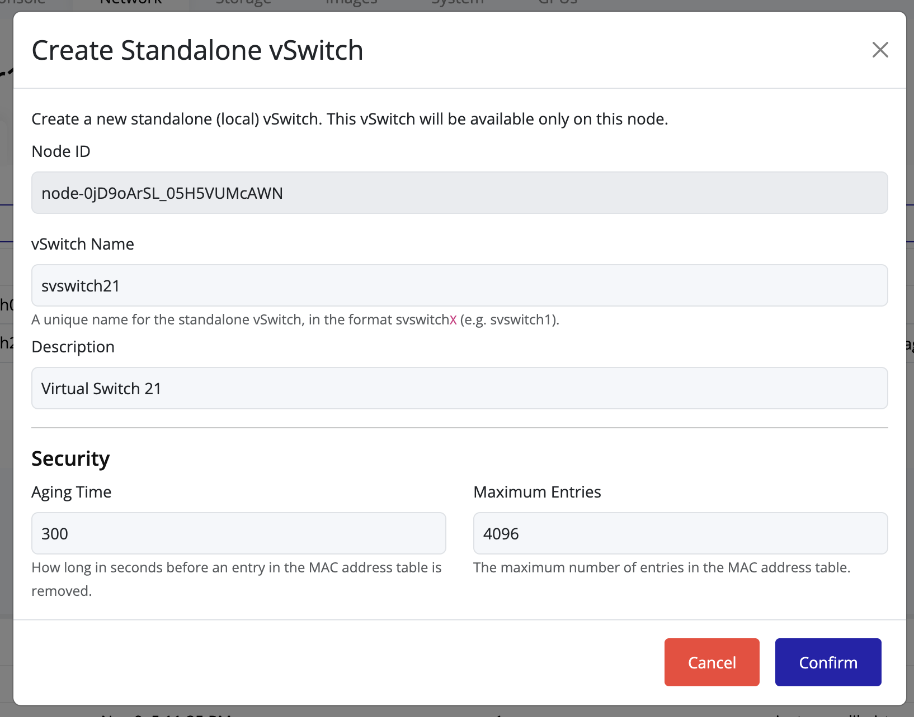
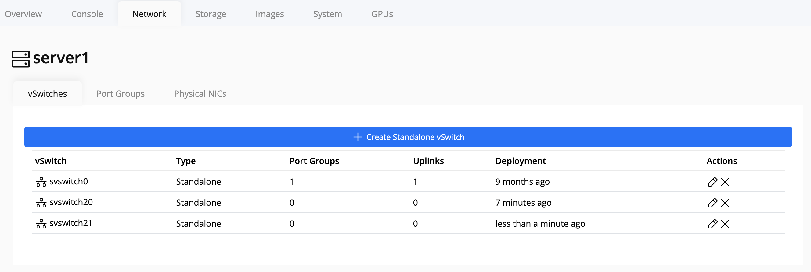

## Creating a vSwitch

A **vSwitch (virtual switch)** connects virtual machines and network interfaces within a node. Each vSwitch acts as a bridge between virtual and physical networks.

To create a new vSwitch:

1. Click on the **node** in the left navigation panel.
2. Select the **Network** tab on the right.
3. Click on **vSwitches**.
4. Click **Create vSwitch**.

   

5. Enter a name for the vSwitch. The name **must follow the required format**:  
   
Here, `svswitch` is the prefix and `X` is a positive integer.  
Example: `svswitch10`, `svswitch21`.

6. Complete the configuration and click **Create**.

7. After creation, the new vSwitch will appear in the **vSwitch list**.

> [!TIP]
> Use a consistent naming convention (e.g., `svswitch10`, `svswitch20`, etc.) to easily identify network mappings across multiple nodes.

> [!WARNING]
> Ensure the vSwitch name is **unique cluster-wide** to prevent conflicts.  
> The vSwitch will **not be created** if a name conflict is detected within the cluster.
