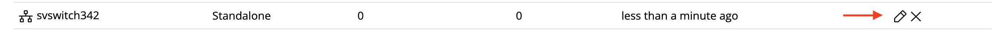
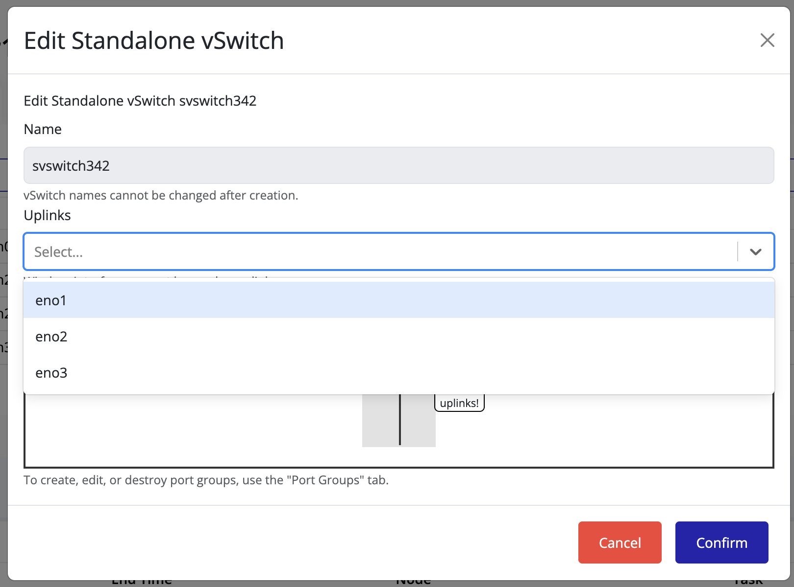
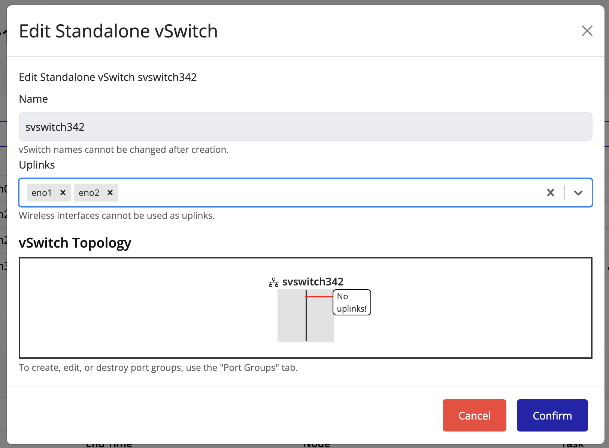
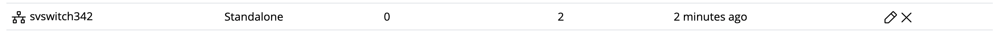
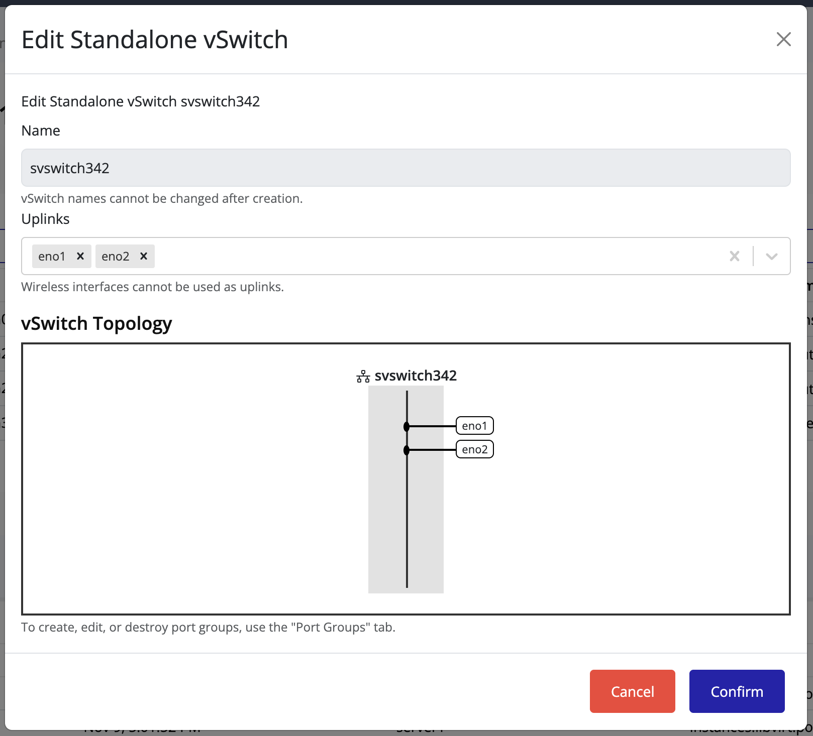

## Editing a vSwitch to Add Uplinks

You can add one or more **uplinks** to a vSwitch to connect it to physical network interfaces on a node. Adding multiple uplinks improves **redundancy** and **fault tolerance**, ensuring higher network availability.

### Steps to Add Uplinks

1. Select the **node** in the left navigation panel.
2. Click the **Network** tab on the right.
3. Click on **vSwitches**.
4. Locate the vSwitch you want to modify and click the **Edit** icon.

   

5. From the **Uplinks** drop-down menu, select one or more network interfaces to attach as uplinks.  
   You can select multiple interfaces to enable redundancy.

   

> [!TIP]
> The image preview may not immediately reflect uplink changes.

   

6. Click **Confirm** to apply the changes.
7. The **Uplink Count** column for the vSwitch updates to reflect the new configuration.

   

8. To verify or visualize the connected uplinks, click the **Edit** icon again.  
   The connected uplinks are listed in the vSwitch details view.

   

> [!TIP]
> Adding multiple uplinks provides **network redundancy**.  
> If one uplink fails, the remaining uplinks continue handling network traffic seamlessly.
