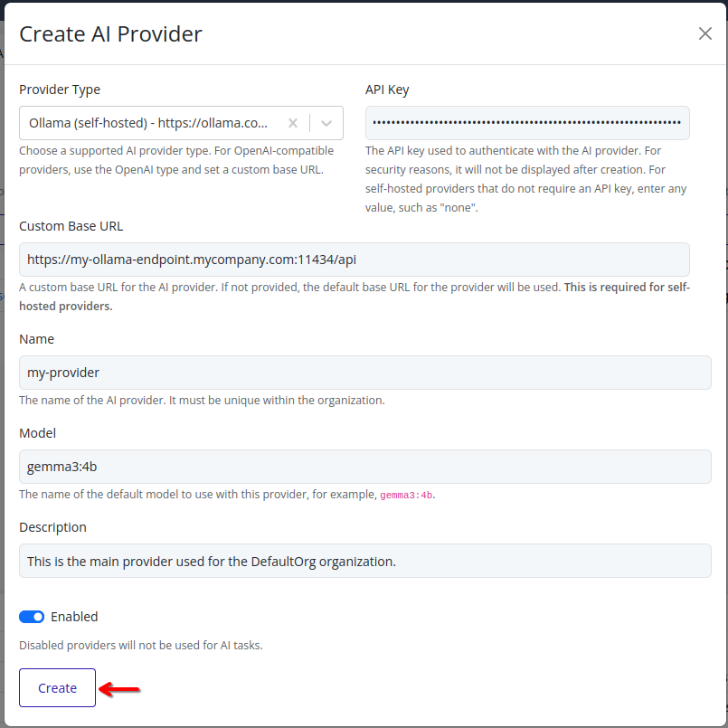

# Add AI Provider
Add an AI provider to your organization to enable AI features in the Pextra CloudEnvironment® web interface. At least one AI provider must be configured and enabled for the AI Assist feature to function. If no AI providers are configured, the AI Assist feature will not be available in the web interface.

> [!NOTE]
> For security reasons, the API keys for AI providers are not displayed in the web interface. API keys cannot be retrieved once set. Store your API keys securely.

## Web Interface
1. Select the organization in the resource tree and view the page on the right. Click on the **AI Providers** tab in the right pane.
   

2. Click the **Add AI Provider** button.
   

3. Choose the AI provider type from the dropdown list. A list of supported AI providers is available in the [Supported AI Providers](./supported.md) section.
	

4. Enter the API key and custom base URL (if applicable) for the selected AI provider.
   

> [!IMPORTANT]
> When using a self-hosted AI provider (such as `ollama` or `lmstudio`), a custom base URL **must** be specified. For cloud-hosted providers, the base URL is pre-configured and does not need to be changed.

5. Enter a name for the AI provider, and an optional description. Disable the provider if you do not want it to be available for use immediately.
   

6. Enter the name of the model to use with this provider. This model will be used for all AI Assist features unless overridden in specific configurations.
   

7. Click **Create** to add the AI provider to your organization. The new AI provider will be listed on the AI Providers page.
	

## Adding OpenAI-Compatible Providers

For AI providers that are OpenAI-compatible but are not explicitly listed above, use the `openai` provider type and configure a custom base URL. This allows you to connect to any service that implements the [OpenAI API specification](https://github.com/openai/openai-openapi/tree/master).

When configuring an OpenAI-compatible provider:
1. Select `openai` as the provider type
2. Set the custom base URL to point to your provider's API endpoint
3. Use the appropriate API key for your chosen provider

This approach works with many third-party AI services and self-hosted solutions that implement OpenAI-compatible APIs.