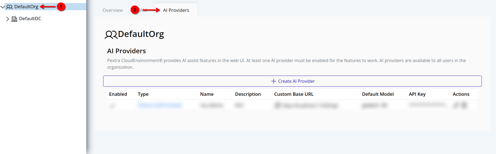

# Delete AI Provider
> [!WARNING]
> If you delete the last AI provider in your organization, the AI Assist feature will no longer be available in the web interface. At least one AI provider must be configured and enabled for AI Assist to function.

## Web Interface
1. Select the organization in the resource tree and view the page on the right. Click on the **AI Providers** tab in the right pane. The AI providers will be listed:
   

2. Click the trash can icon next to the AI provider you want to delete:
   

3. A confirmation dialog will appear. Type in “DESTROY” and click **Confirm** to confirm the deletion of the AI provider:
   
