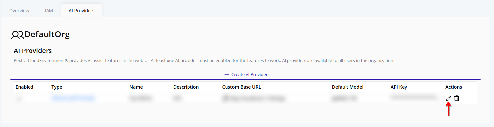
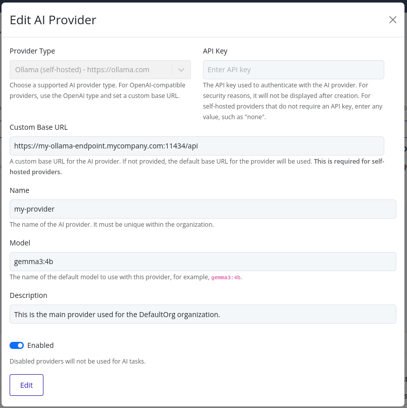
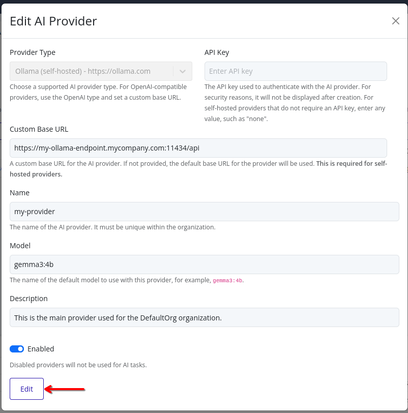

# Edit AI Provider

> [!NOTE]
> For security reasons, the API keys for AI providers are not displayed in the web interface. API keys cannot be retrieved once set. Store your API keys securely.

## Web Interface

1. Select the organization in the resource tree and view the page on the right. Click on the **AI Providers** tab in the right pane. The AI providers will be listed.
   

2. Click the pencil icon next to the AI provider you want to edit.
   

3. Update any fields as needed.
   	

> [!NOTE]
> The API key field will be empty for security reasons. If you need to change the API key, you must enter the new key in this field. The previous key will not be displayed.

4. Click **Edit** to save your changes. The AI provider will be updated with the new configuration.
   