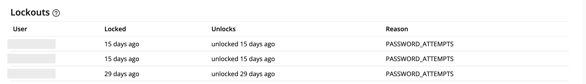

# User Lockouts
After multiple failed login attempts, user accounts may be locked out to enhance security. You can monitor and review these lockouts through the user lockout log.

To view user lockouts:

1. From the left navigation panel, click your **Organization Name**.
2. On the right, click **Audit**.
3. Scroll down to the **Users Lockouts** section to see details of any locked-out users.

