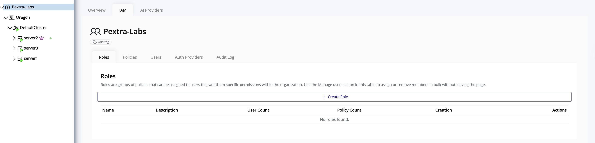

# Identity and Access Management (IAM)

The **Identity and Access Management (IAM)** module enables administrators to manage all aspects of access control within the organization, including:

- Users
- Roles
- Policies
- Authentication providers
- User authentication audit logs

> [!NOTE]
> Access to IAM requires **administrative privileges** at the organization level.

## Accessing IAM

To access the IAM module:

1. In the left panel, select your **organization**.
2. In the right panel, click the **IAM** tab.

> [!TIP]
> Use IAM to enforce security policies, manage roles and permissions, and audit user activity across your organization.
