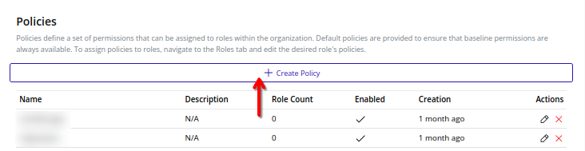
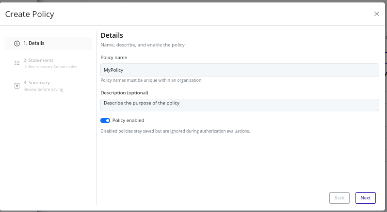
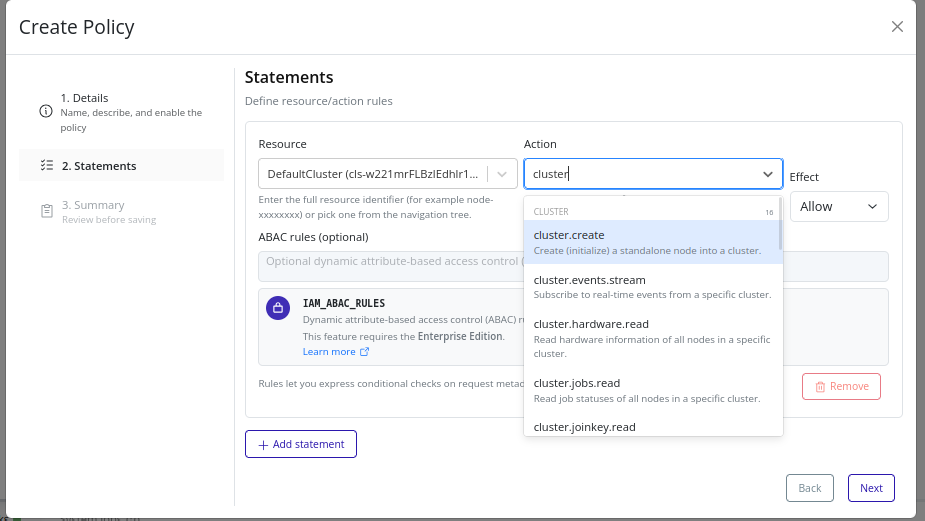
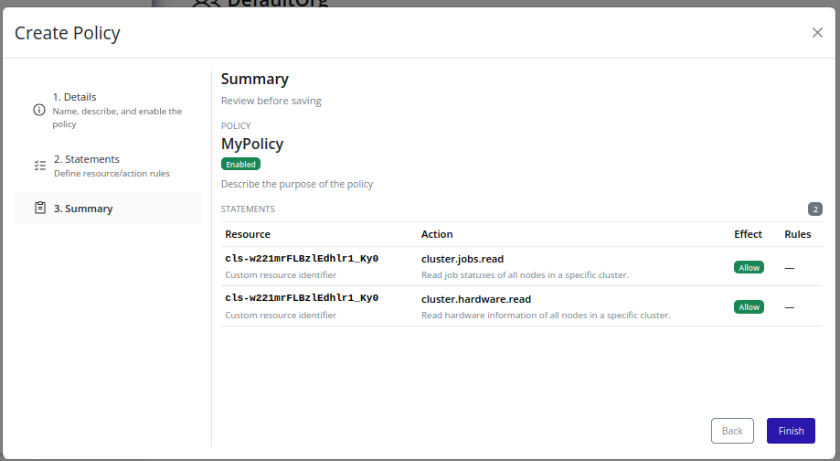

# Create Policy
1. Select the organization in the resource tree and view the page on the right. Click on the **IAM** tab in the right pane. Then, select the **Policies** sub-tab:
   
2. Click the **Create Policy** button at the top:
   
3. In the **Details** step, provide basic information:
   
4. In the **Statements** step, define the policy statements. See the **Statement Builder** section below for details.
   
5. Review the summary and click **Finish** to finalize:
   

## Statement Builder
Use the statement builder to define individual policy statements. Each statement includes the following fields:
- **Effect**: Choose either `allow` or `deny` to specify whether the statement grants or restricts access. `deny` statements take precedence over `allow` statements.
- **Actions**: Select one or more actions that the statement applies to. Use the dropdown to search and select actions.
- **Resources**: Specify the resources the statement applies to. You can use wildcards (`*`) for broader scopes.
- **Conditions**: (Optional) Add ABAC rules to further refine when the statement applies. See the [ABAC Rules](../abac-rules.md) section for details.