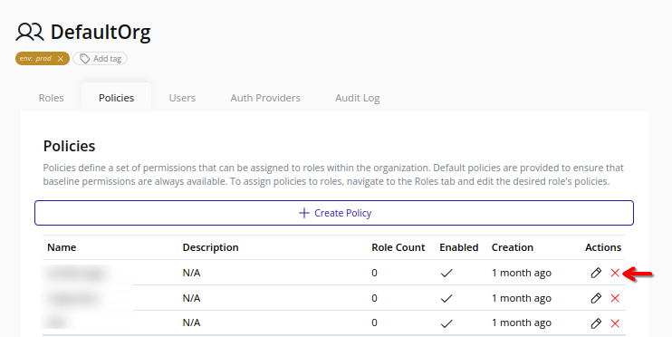
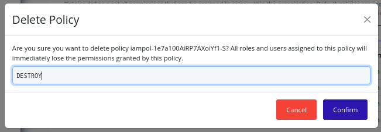

# Delete Policy
>[!IMPORTANT]
>Policy deletion triggers an organization policy update. Changes take effect immediately and may impact user access.

1. Select the organization in the resource tree and view the page on the right. Click on the **IAM** tab in the right pane. Then, select the **Policies** sub-tab:
    
2. Click the **Delete** button beside the target policy:
    
3. In the confirmation dialog, type "DESTROY" and click **Confirm** to confirm the deletion of the policy:

    
