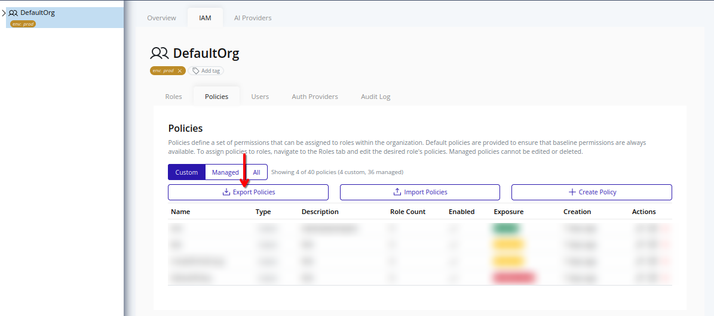
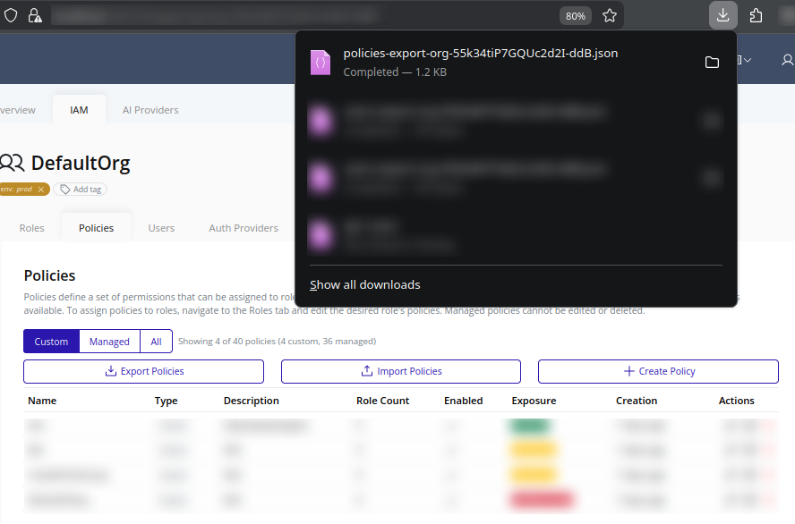

# Export Policies
Use policy export to download custom IAM policies from the selected organization as JSON for backup, audit, or migration.

>[!NOTE]
>Exporting policies requires the `organization_iam_policy.export` permission.

## Web Interface
1. Select the organization in the resource tree and view the page on the right. Click **IAM** in the right pane, then select **Policies**. Click **Export Policies**.
   

2. The browser should download a JSON file:
   

3. Store the file securely using your organization's backup policy. To import these policies into another environment, refer to the [Import Policies](./import.md) section.