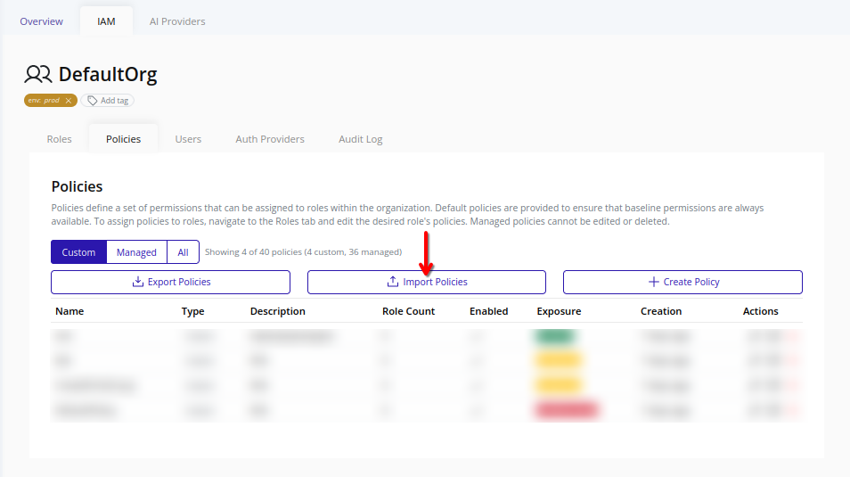
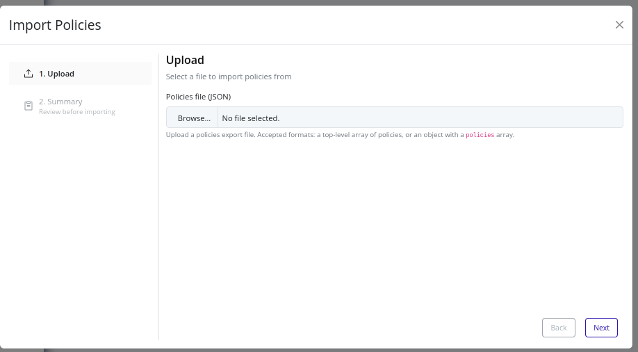
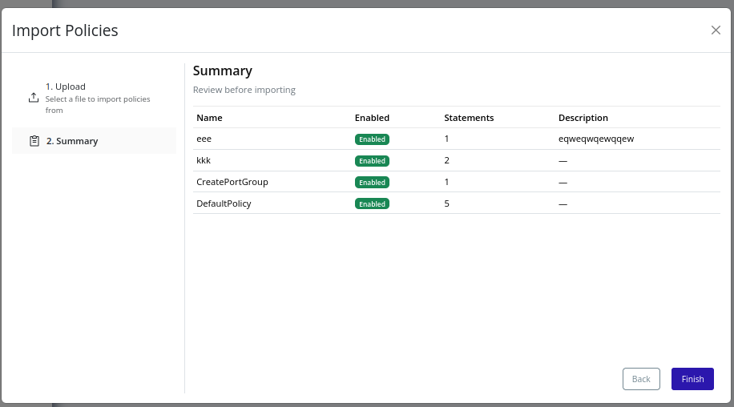
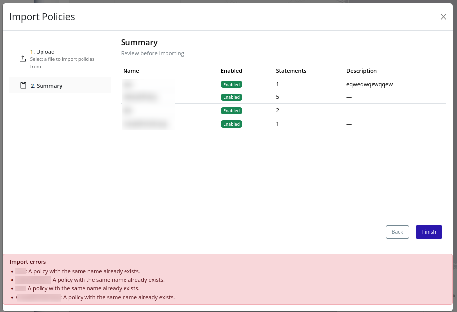

# Import Policies
Use policy import to bulk-create custom IAM policies in the selected organization from a JSON file.

>[!NOTE]
>Importing policies requires the `organization_iam_policy.import` permission.

## Supported File Format
The import file must be in JSON format, structured as either:
1. A top-level array of policies.
2. An object containing a `policies` array.

Each policy item should include:
- `name` (string)
- `enabled` (boolean)
- `description` (optional string)
- `policy` (array of statements)

Each `policy` item should be a policy statement, as defined in the [Model](./model.md) section.

>[!TIP]
>For an example source file, [Export Policies](./export.md) to generate a file with correct shape, then modify as needed for import.

>[!IMPORTANT]
>The import will fail if any policy in the file includes ABAC rules and the `IAM_ABAC_RULES` feature flag is not enabled. Review the 

## Web Interface
1. Select the organization in the resource tree and view the page on the right. Click **IAM** in the right pane, then select **Policies**. Click **Import Policies**.
   

2. Upload your policies JSON file. Ensure it follows the supported shape and includes required fields.
   

3. Continue to the **Summary** step and review all policies that will be created.
   

4. Click **Finish** to begin import. If import succeeds, the modal will close. New policies are available immediately.

5. If import fails, review per-policy errors:
   
