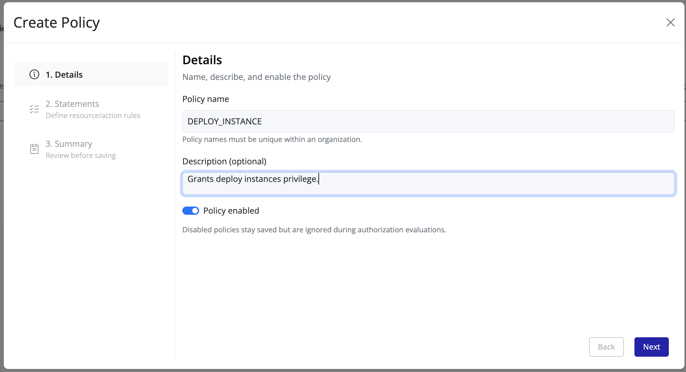
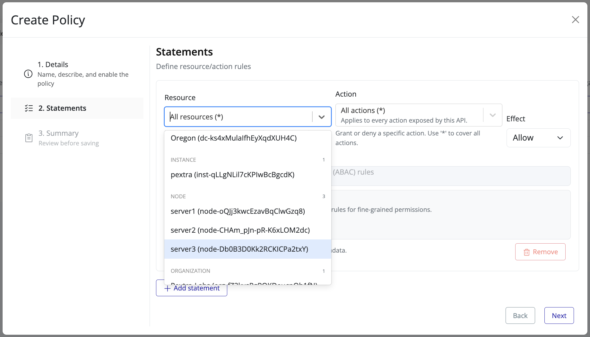
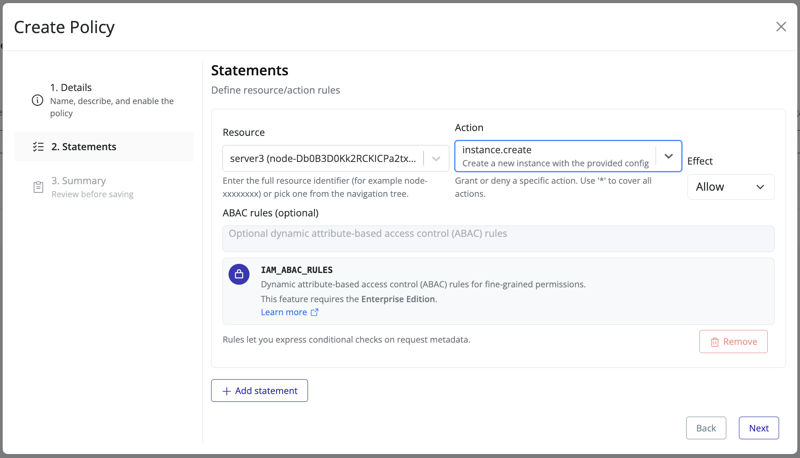
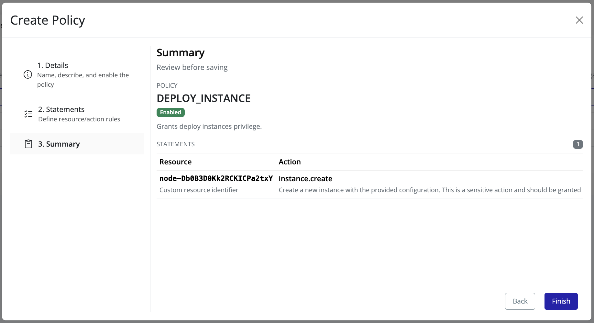
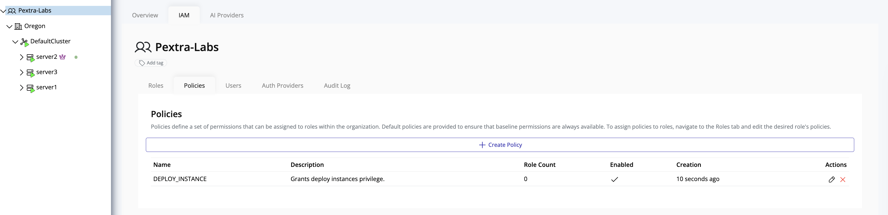

# Create Policy

To create a new policy in Pextra Cloud Environment®:

1. In the **left panel**, select your **organization**.
2. In the **right panel**, click the **IAM** tab.

3. Click **Create Policy**. A guided overlay will appear to assist with policy creation.

4. Enter the following details:
    - **Policy Name**
    - **Description**  
      Then click **Next**.

5. Define the policy statements:
    - **Target Resource**: organization, specific data center, cluster, node, or instance
    - **Action**: operation(s) allowed or denied on the resource
    - **Effect**: **Allow** or **Deny**

6. To add additional statements, click **Add Statement** and configure the resource, action, and effect for each.

> [!TIP]
> Limit policies to **25 statements** where possible. While the engine supports up to 1024 statements, excessive statements increase complexity and reduce maintainability.

7. Click **Next**, review the summary carefully to confirm all settings, then click **Finish**.

8. The newly created policy will appear in the **Policies** list:

> [!TIP]
> Review policy assignments regularly to ensure that access controls align with organizational security standards.
