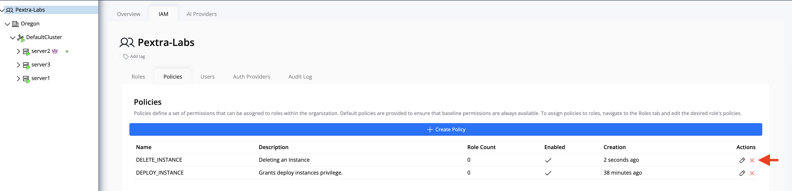
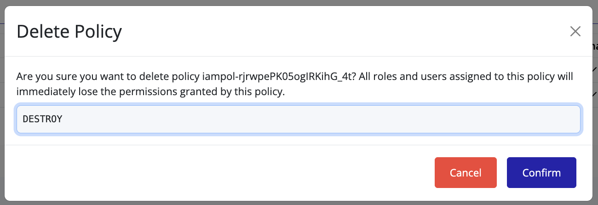
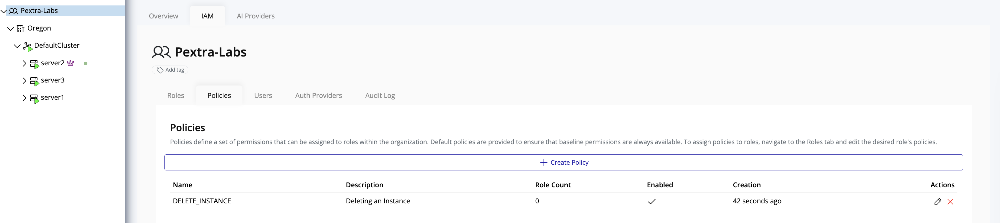

# Delete Policy

To delete a policy in Pextra Cloud Environment®:

1. Ensure you have **administrative privileges**.
2. Navigate to the **Policies** tab:
    - In the **left panel**, select your **organization**.
    - In the **right panel**, click **IAM**.
    - Select the **Policies** tab to view all policies.

3. Locate the policy you wish to delete and click the **delete icon**.

4. In the confirmation overlay, type the required **confirmation string** and click **Confirm**.

5. The policy will be removed from the list.

> [!TIP]
> Deleting a policy is **irreversible**. Ensure that the policy is not actively assigned to users or roles before deletion.
