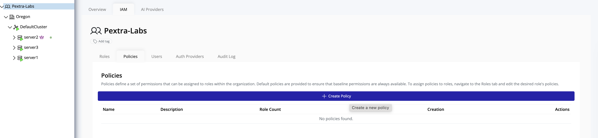

# Policy Management

This section provides an overview of **policy management** in Pextra Cloud Environment®. Policies define **what actions are allowed or denied** on specific resources and are the foundation of access control within the platform. Administrators use policies to precisely control user and role permissions.

Policies in Pextra Cloud Environment® are **user-defined** and consist of one or more statements. Each statement specifies:
- A **target resource** (such as an organization, data center, cluster, node, or instance)
- One or more **actions** that can be performed on the resource
- An **effect** that determines whether the action is **allowed** or **denied**

Policies can be attached to **roles**, and users inherit permissions by being assigned to those roles. Access to policy management requires **administrative privileges** at the organization level.

## Accessing Policies

1. In the **left panel**, select your **organization**.
2. In the **right panel**, click the **IAM** tab.
3. Navigate to the **Policies** tab.

> [!TIP]
> Follow the principle of least privilege when designing policies. Grant only the permissions required for a user or role to perform its intended tasks.
