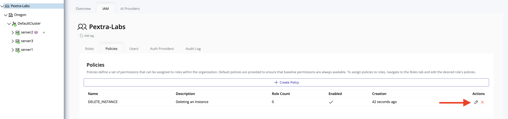
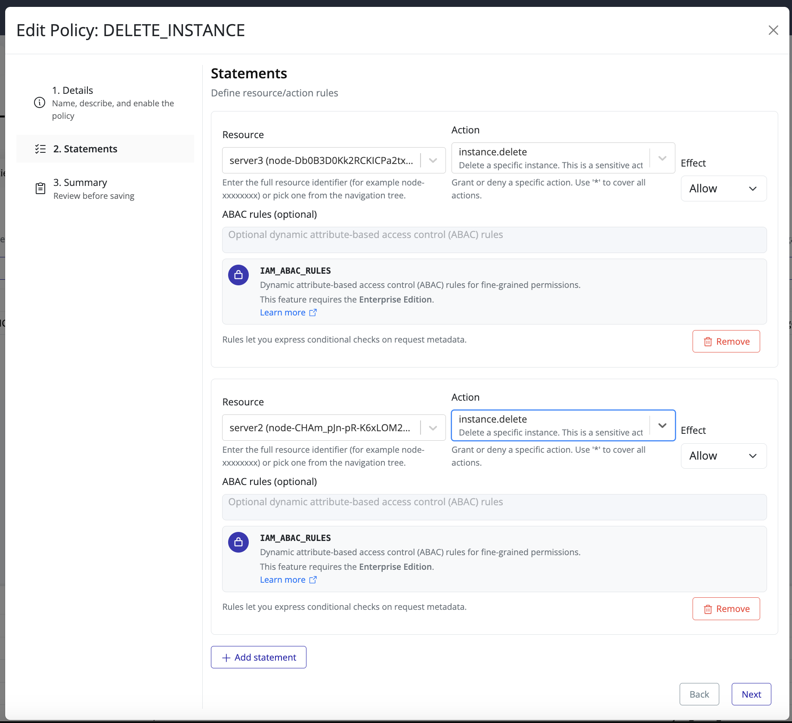
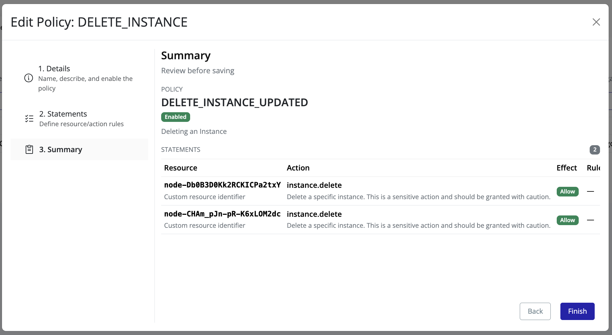

# Update Policy

To update an existing policy in Pextra Cloud Environment®:

1. In the **left panel**, select your **organization**.
2. In the **right panel**, click the **IAM** tab.
3. Locate the policy you want to update and click the **edit icon**.

4. The overlay will display the current policy details. Update the **Policy Name** and/or **Description** as needed.

5. Click **Next** to update the policy statements.

6. Click **Next** to review your changes, then click **Finish** to apply the updates.

7. The policy list will now reflect the updated policy.

> [!TIP]
> Regularly review policy assignments to ensure that access controls remain aligned with organizational security standards.
