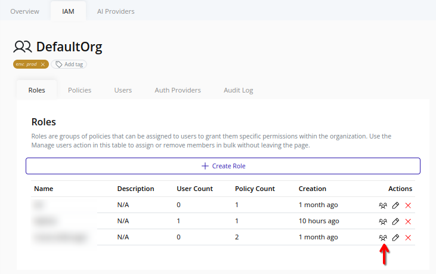
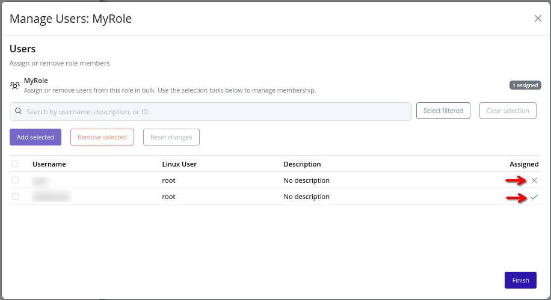
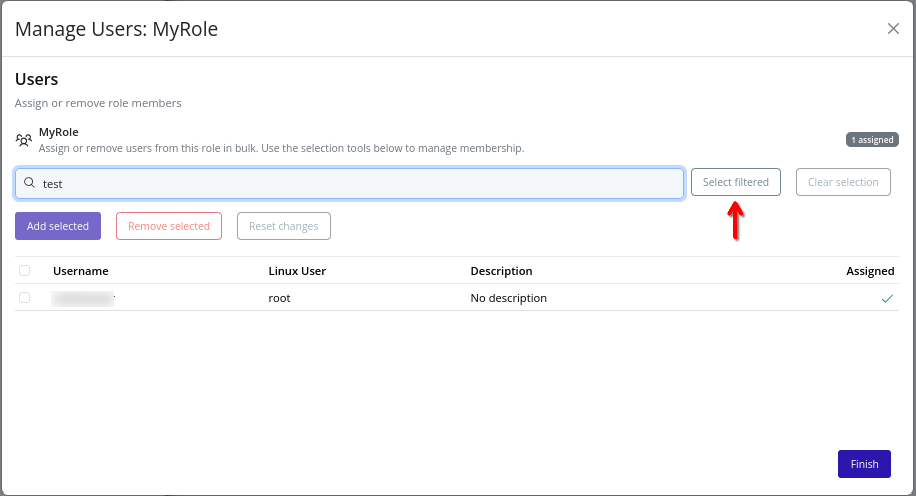

# Assign Users to a Role
>[!IMPORTANT]
>Role assignment triggers an organization policy update. Changes take effect immediately and may impact user access.

1. Select the organization in the resource tree and view the page on the right. Click on the **IAM** tab in the right pane. Then, select the **Roles** sub-tab:
   
2. Click the **Assign Users** button beside the target role:
   
3. In the dialog, all users in the organization are listed.
4. Select or deselect users, then click **Add selected** or **Remove selected** to modify role assignments. The user's role membership is reflected in the **Assigned** column. To revert to the original state, click **Reset changes**:
   
5. Search for users (by username, description, or ID) using the search bar at the top of the dialog. Filtered users can be selected by clicking **Select filtered**:
    
6. To save changes, click **Finish**. The role's user assignments are updated accordingly.

>[!NOTE]
>The root user is excluded from role assignments, as it has unrestricted access.