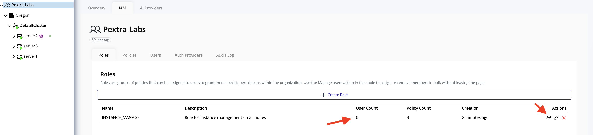
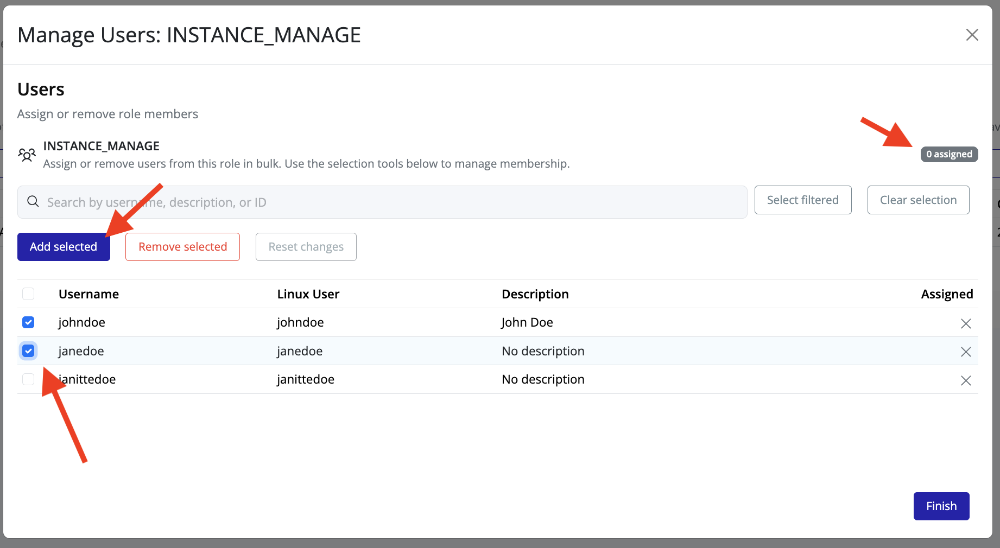
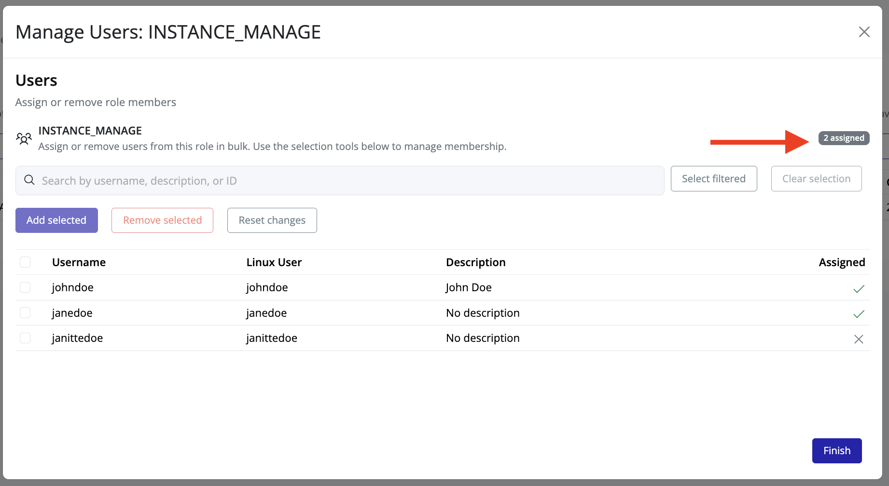
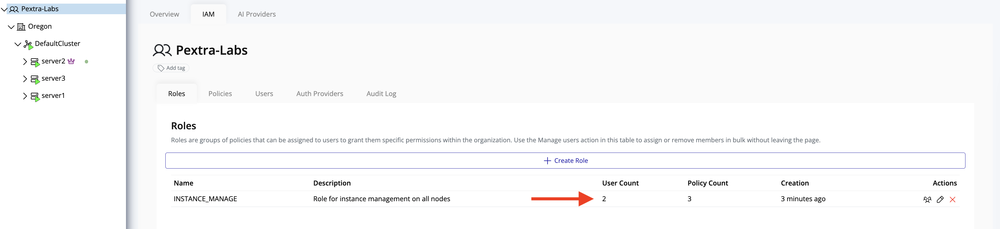

# Assign Users to a Role

After creating roles, you can assign users to a role. Users assigned to a role inherit **all permissions** granted by the policies associated with that role.

## Steps to Assign Users

1. In the **left panel**, select your **organization**.
2. In the **right panel**, click the **IAM** tab.
3. Navigate to the **Roles** tab.

4. Each role displays the **number of assigned users**. Click the **users icon** for the role you want to modify.  
   A popup overlay will appear to guide you through the assignment process.

5. In the overlay, you will see a list of all available users:
    - **Green checkmark** indicates users currently assigned to the role.
    - **Checkbox** allows selection of users to assign.

Select the users you want to assign to the role by checking the corresponding boxes, then click **Add Users**.

7. The number of assigned users will update immediately. Successfully added users will display a **green check** next to their name.

8. Once finished, click **Finish**. The Roles list will now reflect the updated **number of assigned users**.

> [!TIP]
> Regularly review role assignments to ensure they remain aligned with organizational security policies and user responsibilities.
