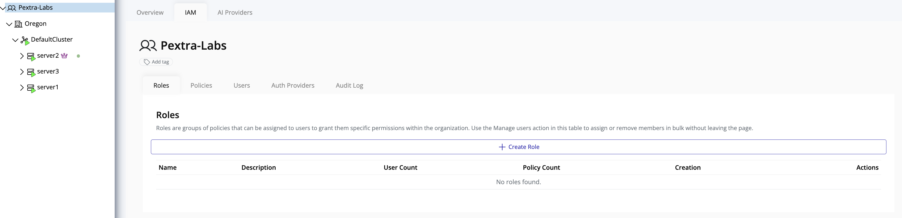
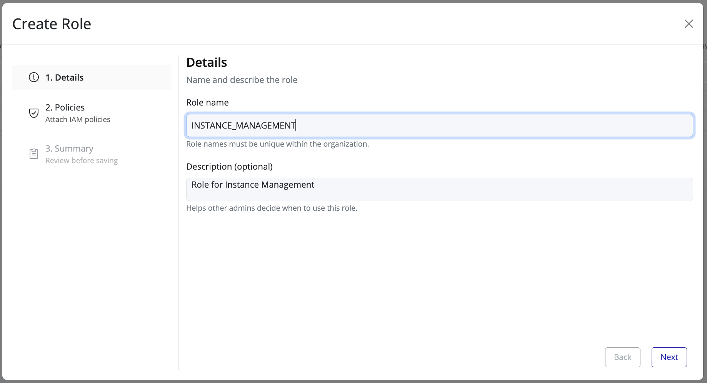
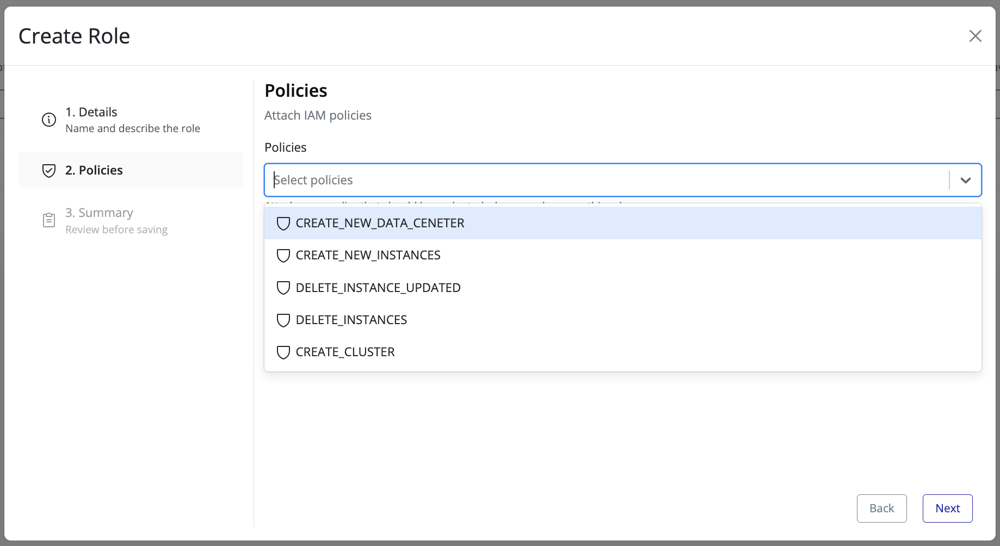
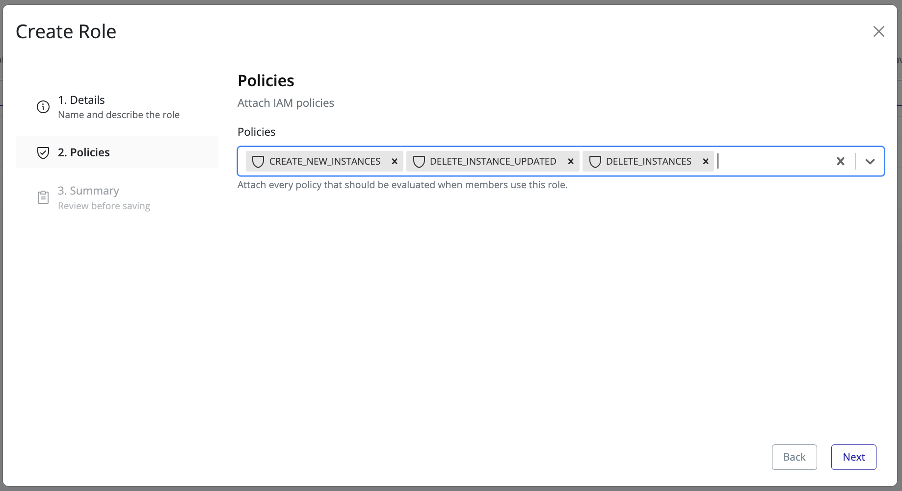
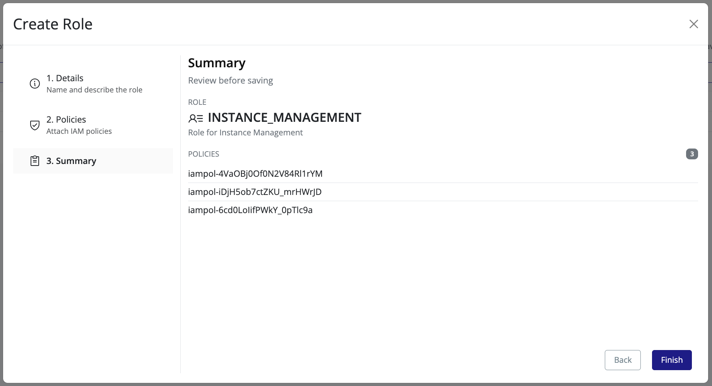

# Create Role

This section describes how to create a new role in Pextra Cloud Environment®.

## Steps to Create a Role

1. In the **left panel**, select your **organization**.
2. In the **right panel**, click the **IAM** tab.
3. Navigate to the **Roles** tab.

4. Click **Create Role**.  
   A guided overlay wizard will appear to assist you through the role creation process.

5. Enter a **unique role name** and a **clear description**, then click **Next**.

6. Select one or more **policies** to associate with the role, then click **Next**.  
   If the required policy does not exist, create it first by following the **Policy Management** guide.

7. Review the **Role Summary** to ensure all details are correct, then click **Finish**.

8. The newly created role will appear in the **Roles** list.

> [!TIP]
> Assign permissions through roles rather than directly through policies. This approach simplifies access management and improves long-term maintainability.
