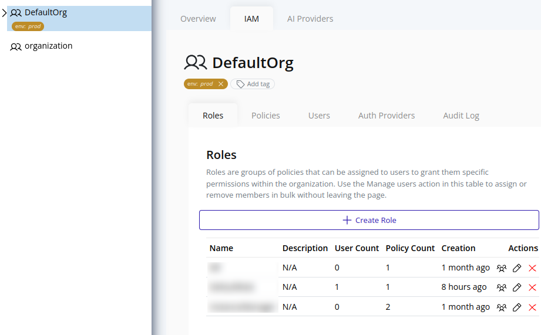
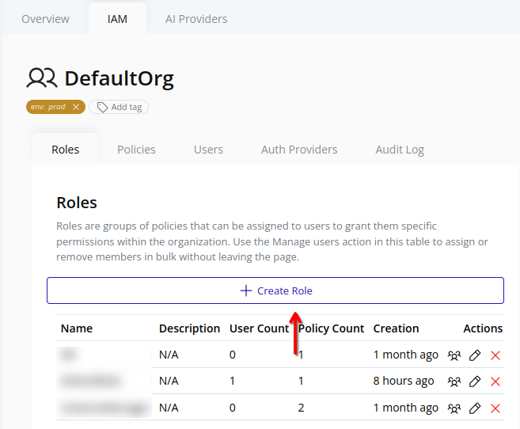
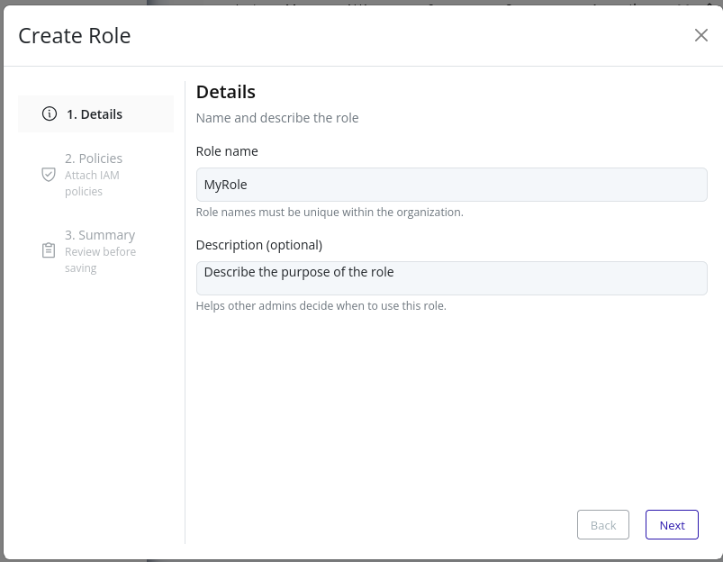
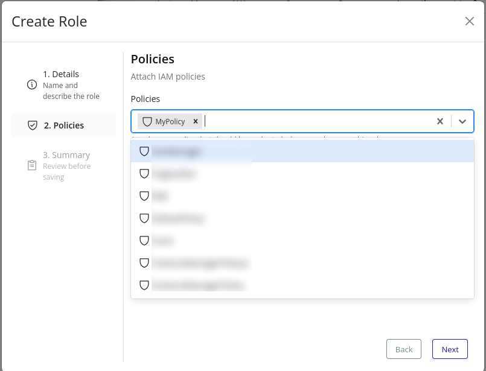

# Create Role
1. Select the organization in the resource tree and view the page on the right. Click on the **IAM** tab in the right pane. Then, select the **Roles** sub-tab:
    
2. Click the **Create Role** button at the top:
    
3. In the **Details** step, provide basic information:
    
4. In the **Policies** step, select one or more existing policies to attach to the role:
    
5. Review the summary and click **Finish** to finalize:
    