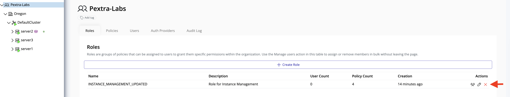
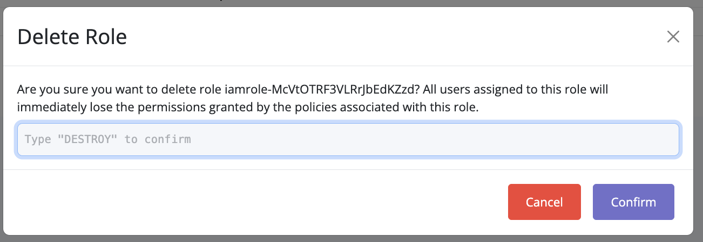
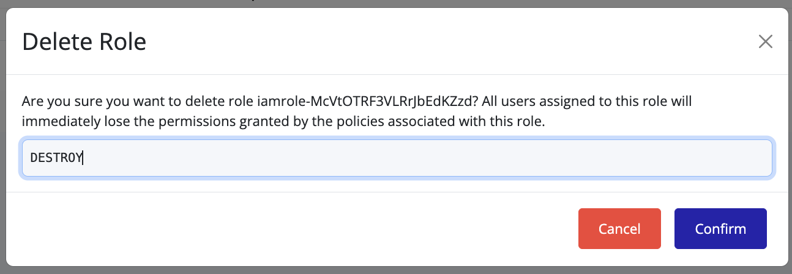
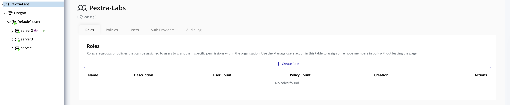

# Delete Role

This section explains how to delete a role in Pextra Cloud Environment®.

## Steps to Delete a Role

1. In the **left panel**, select your **organization**.
2. In the **right panel**, click the **IAM** tab.
3. Navigate to the **Roles** tab.

4. Locate the role you want to delete and click the **delete icon**.  
   A confirmation overlay will appear.

5. Enter the required **confirmation string** to verify the action.

6. Click **Confirm** to delete the role.

> [!WARNING]
> All users associated with this role will **immediately lose access** to the permissions granted by the role.

> [!WARNING]
> This action is **irreversible**. Ensure the role is no longer required before deleting it.
