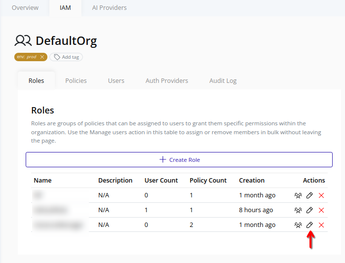
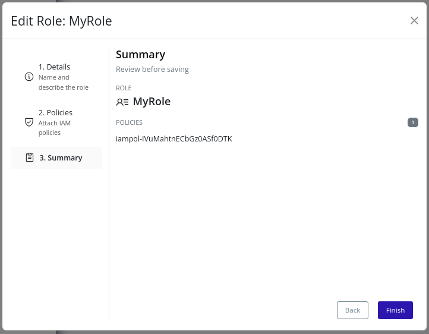

# Edit Role
>[!IMPORTANT]
>Role editing triggers an organization policy update. Changes take effect immediately and may impact user access.

1. Select the organization in the resource tree and view the page on the right. Click on the **IAM** tab in the right pane. Then, select the **Roles** sub-tab:
   
2. Click the **Edit** button beside the target role:
   
3. Modify the fields as described in the [Create Role](./create.md) section.
4. Review the summary and click **Finish** to save changes:
   
