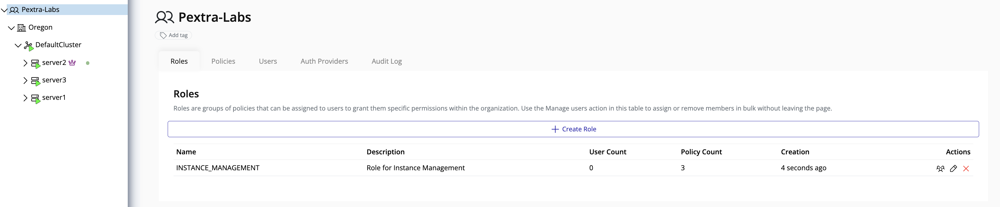

# Roles Management

Roles define a collection of **policies** that can be assigned to users. By attaching a user to a role, the user inherits **all permissions** granted by the policies associated with that role. Roles simplify access management by grouping related permissions into a single, reusable entity.

This section describes how to view roles and understand their associated operations.

## Viewing Roles

To view all roles within an organization:

1. In the **left panel**, select your **organization**.
2. In the **right panel**, click the **IAM** tab.
3. Select the **Roles** tab.

The Roles page displays all available roles along with their associated policies.

> [!TIP]
> Use roles to manage permissions at scale. Assigning users to roles is more efficient and less error-prone than managing individual policy assignments.
