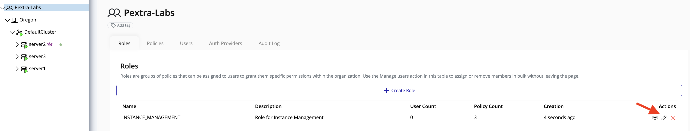
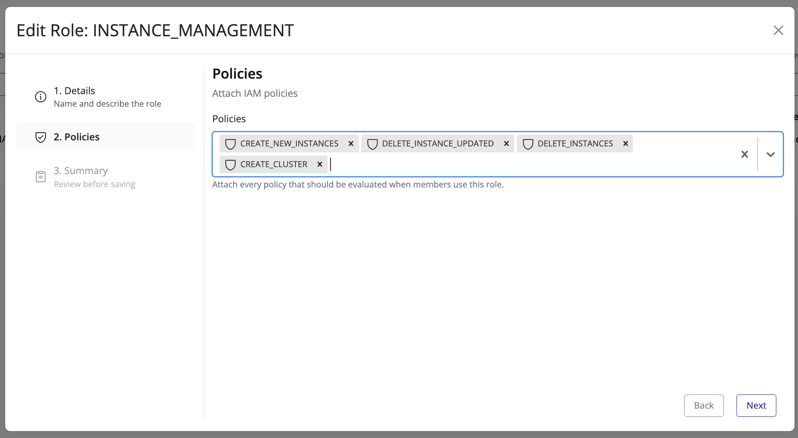
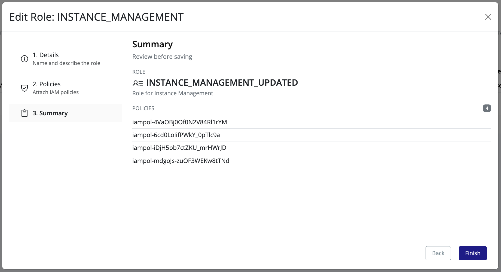

# Update Role

This section describes how to update an existing role in Pextra CloudEnvironment®.

## Steps to Update a Role

1. In the **left panel**, select your **organization**.
2. In the **right panel**, click the **IAM** tab.
3. Navigate to the **Roles** tab.

4. Locate the role you want to update and click the **edit icon**.  
   An overlay dialog will open with the role details.

5. Update the **role name** and/or **description** as needed, then click **Next**.

6. Modify the **attached policies** by adding or removing policies as required, then click **Next**.

7. Review the **summary of changes** to ensure everything is correct, then click **Finish**.

8. The role will be updated immediately and the changes will be reflected in the **Roles** list.

> [!TIP]
> Review role permissions regularly to ensure they remain aligned with organizational security requirements and the principle of least privilege.
