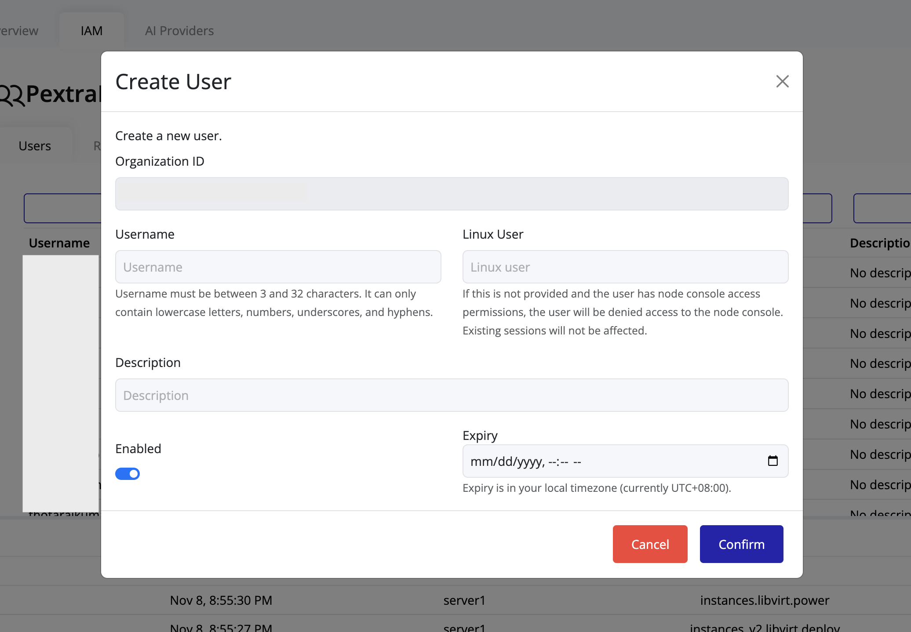

# Creating a User

Administrators can create new users directly from the IAM interface.

## Steps to Create a User

1. Navigate to **IAM** under your organization view.
2. Click **+ Create User** at the top of the **Users** page.
3. The **Create User** dialog will appear:

   

4. The **Organization ID** field will be prefilled.
5. Complete the required user information:

    - **Username**
    - **Linux User** (Optional)
    - **Description**
    - **Enable Toggle** (Enable or Disable User; for local or external accounts)
    - **Expiry Date** (Optional; assign an expiration date for the user)

6. Click **Confirm** to create the user.

   

7. The new user will now appear in the **Users** list:

   

> [!TIP]
> Review the user’s details carefully before confirming. Use the **Enable Toggle** and **Expiry Date** options to enforce account policies and temporary access when needed.
