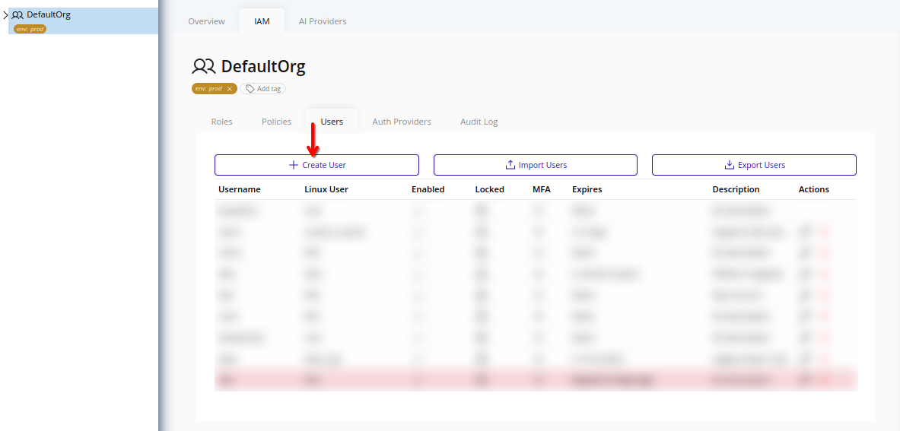
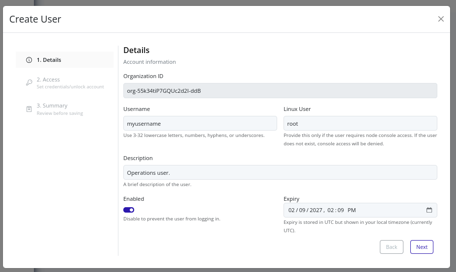
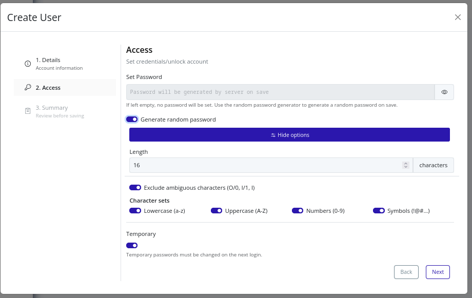
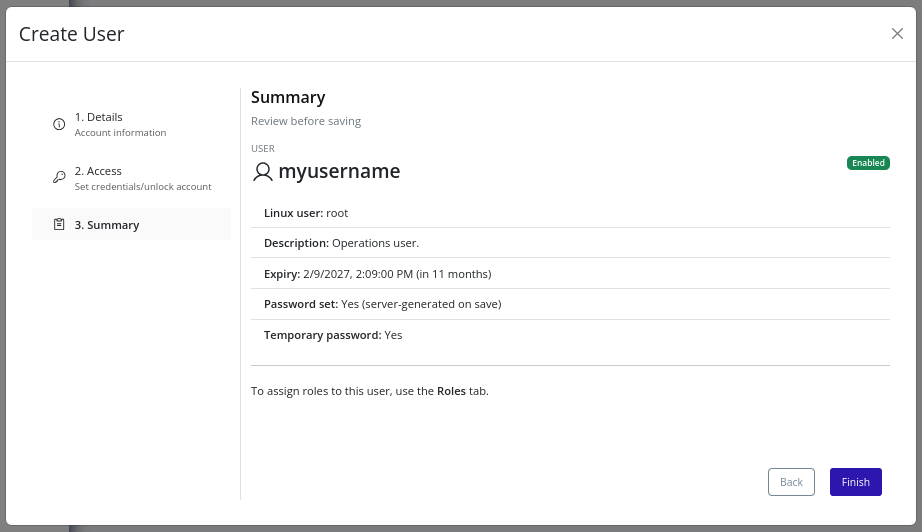
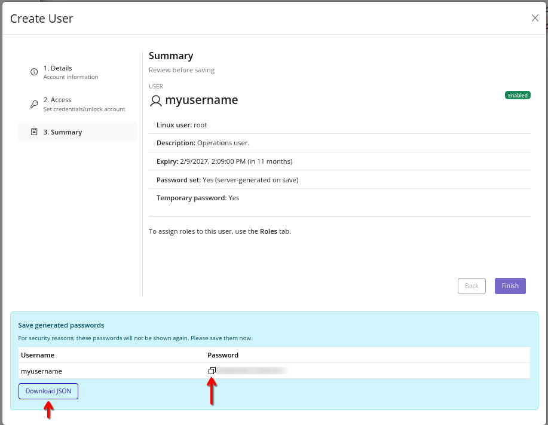

# Create a User

Administrators can create new users directly from the IAM interface.

1. Select the organization in the resource tree and view the page on the right. Click **IAM** in the right pane, then select **Users**. Click **Create User**.
   

2. In the **Details** step, fill in the following fields:
   - **Username** (required): A unique identifier for the user within the organization.
   - **Linux user** (optional): If specified, this value is used for Linux user mapping when the user accesses node consoles.
   - **Description** (optional): A free-form text field to document the user's purpose or role.
   - **Enable** (default: enabled): Toggle to create the user in an enabled or disabled state.
   - **Expiry** (optional): An optional expiration date after which the user will be automatically disabled.
   

3. Continue to the **Access** step to configure credentials. You can choose to set a password manually, have the system generate a random password, or leave the password blank to create the user without setting a password in this flow. The default random password options are a length of 16 characters, including uppercase, lowercase, numbers, and symbols.
   

4. Continue to the **Summary** step, review all entered values, and click **Finish** to create the user.
   

5. If creation succeeds with generated credentials, copy or download the generated password before closing. For security reasons, these values are not retrievable after closing the modal.
   
