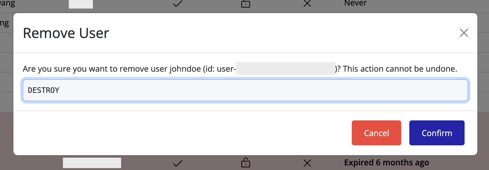

# Deleting a User

To remove a user from the IAM interface:

1. Locate the user in the **Users** list.
2. Click the **delete icon** next to the user’s entry.
3. In the **Delete User** overlay, type the required **confirmation word**.
4. Click **Confirm** to complete the deletion.

> [!TIP]
> Ensure you have reviewed the user’s roles and permissions before deletion, as this action cannot be undone.
