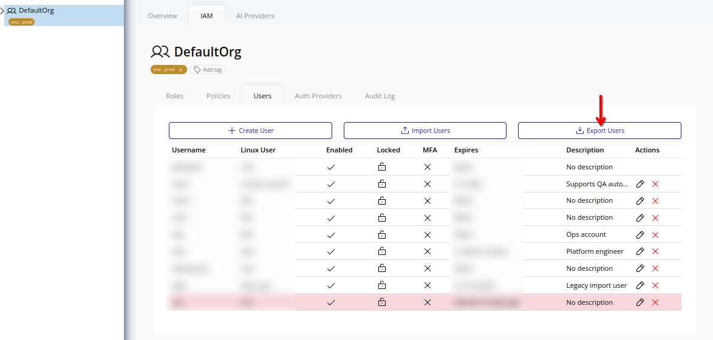
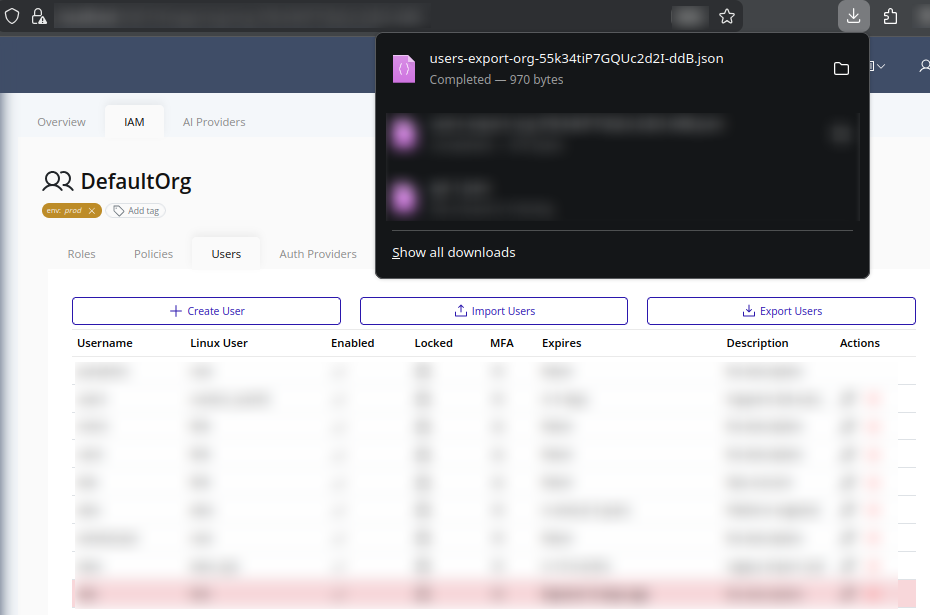

# Export Users
Use user export to download organization users as JSON for migration, review, or backup workflows.

>[!NOTE]
>Exporting users requires the `user.export` permission.

>[!IMPORTANT]
>Exported user data does not include credentials (passwords, password hashes, MFA secrets, or session data).

## Web Interface
1. Select the organization in the resource tree and view the page on the right. Click **IAM** in the right pane, then select **Users**. Click **Export Users**.
   

2. The browser will download a JSON file named in this format:
   - `users-export-<organization-id>.json`
   

3. Store the file securely according to your organization's backup and data handling policies. To import users into another environment, refer to the [Import Users](./import.md) section.

## Export Content
Each exported user can include:
- `username`
- `linux_user`
- `enabled`
- `description`
- `expiry`
