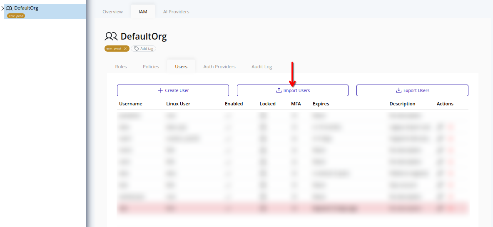
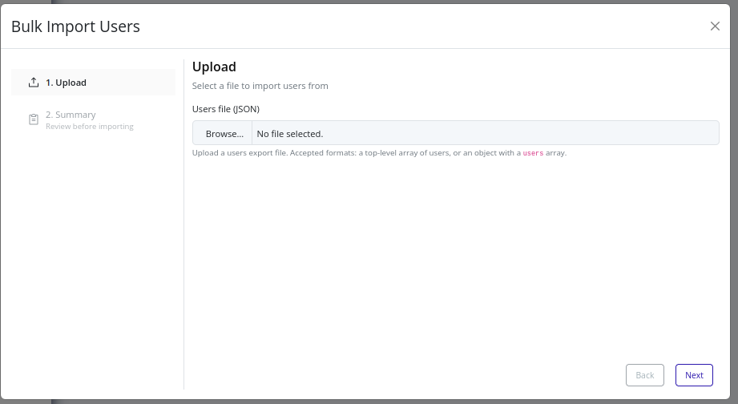
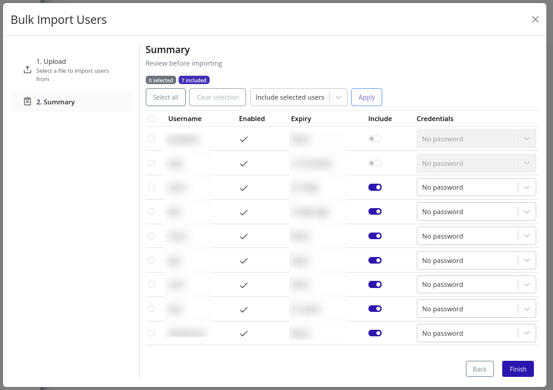
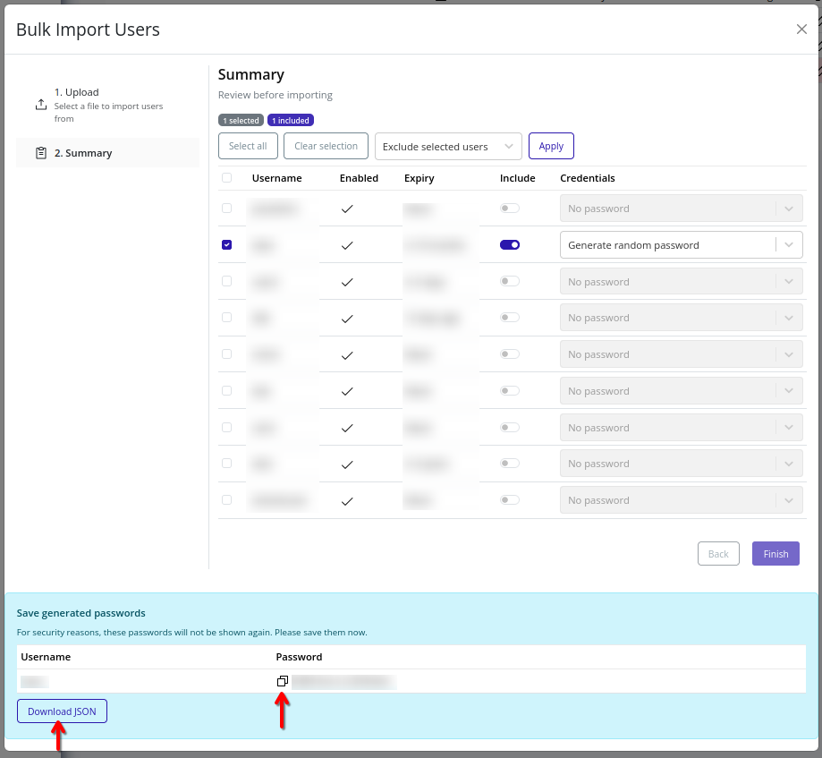
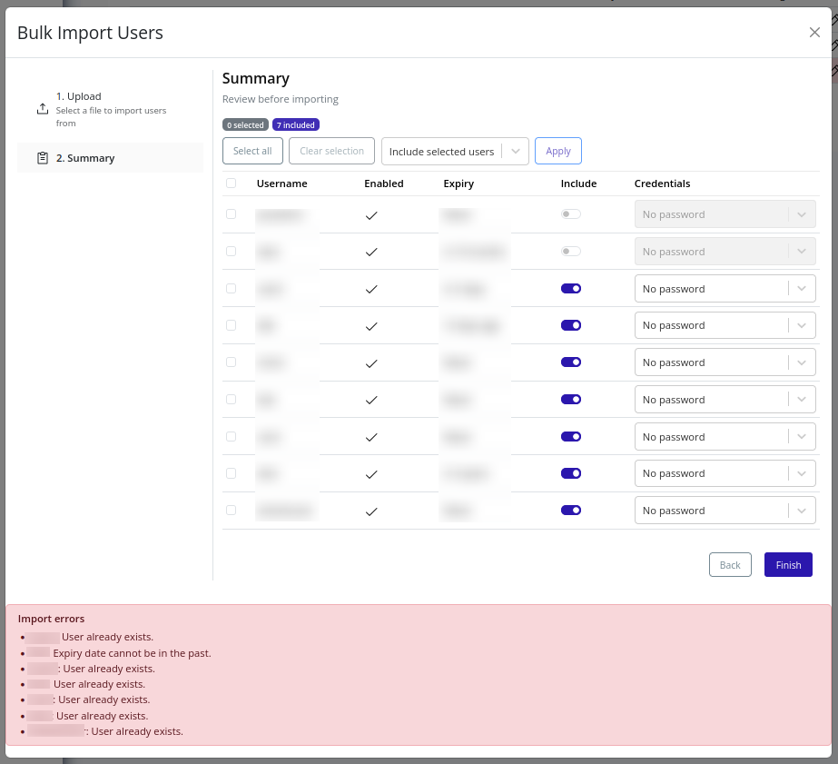

# Import Users
Use user import to bulk-create users in the selected organization from a JSON file.

>[!NOTE]
>Importing users requires the `user.import` permission.

## Supported File Format
The import file must be in JSON format, structured as either:
1. A top-level array of users.
2. An object containing a `users` array.

Each user item can include:
- `username` (required)
- `enabled` (required)
- `linux_user` (optional)
- `description` (optional)
- `expiry` (optional)
- `password` (optional)
- `random_password` (optional)
- `temporary` (optional)

>[!TIP]
>For an example source file, see [Export Users](./export.md) to generate a file with correct shape, then modify as needed for import. Exported user data does not include credentials.

## Credential Modes
For each user, select one of the following credential modes:
- **No password**: creates the user without setting a password in import.
- **Generate random password**: server generates a strong password.
- **Use imported password**: uses the password present in the file.

## Web Interface
1. Select the organization in the resource tree and view the page on the right. Click **IAM** in the right pane, then select **Users**. Click **Import Users**.
   

2. Upload your users JSON file. Ensure it follows the supported shape and includes required fields.
   

3. Continue to **Summary**. You can exclude specific users from import, select credential modes per user, and perform bulk actions on selected rows.
   

4. Click **Finish** to begin import.

5. If import succeeds with generated credentials, copy or download generated passwords before closing. For security reasons, these values are not retrievable after closing the modal.
   

6. If import fails, review per-user errors:
   