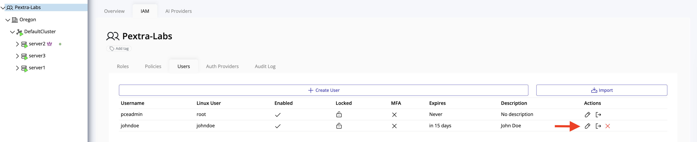
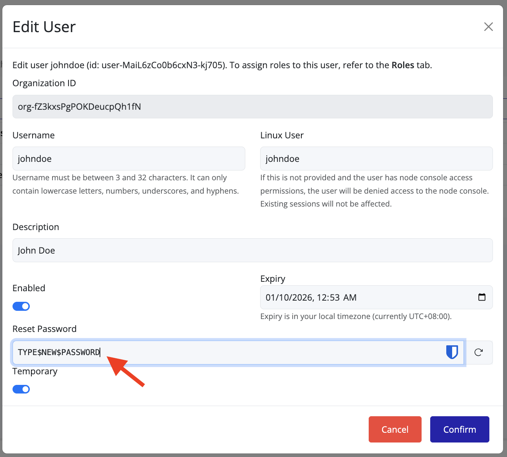

# Reset a User Password

To reset a user's password:

1. Navigate to the **Users** tab:
    - From the **left panel**, select your **organization**.
    - In the **right panel**, click the **IAM** tab.
    - Select the **Users** tab to view all users.

2. Locate the user whose password needs to be reset and click the **edit icon**.

3. Enter the **new password** and ensure it is shared with the user **securely**.

> [!TIP]
> Always use a secure channel to share passwords. Avoid sending credentials in plain text or over the same channel.

> [!TIP]
> Enable the **"Temporary"** toggle to require the user to change the password upon first login.

> [!TIP]
> Verify the identity of the user receiving the credentials and confirm that they have successfully received them.
