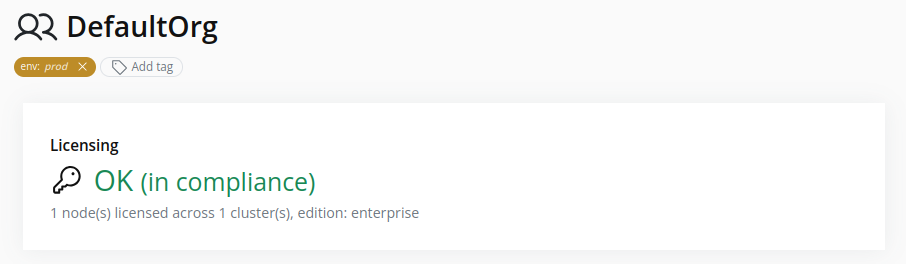
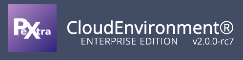

# View Licensing Status
1. Select the organization in the resource tree.
2. Locate the **Licensing** card in the right pane. It shows the current edition and status:
  
3. The organization edition is also displayed in the top-left corner of the web interface:
  

To check a cluster's licensing status within the organization, refer to the [Check Licensing Status](../../clusters/check-licensing-status.md) section.
