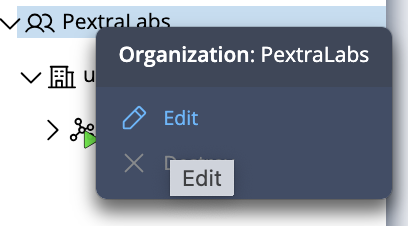
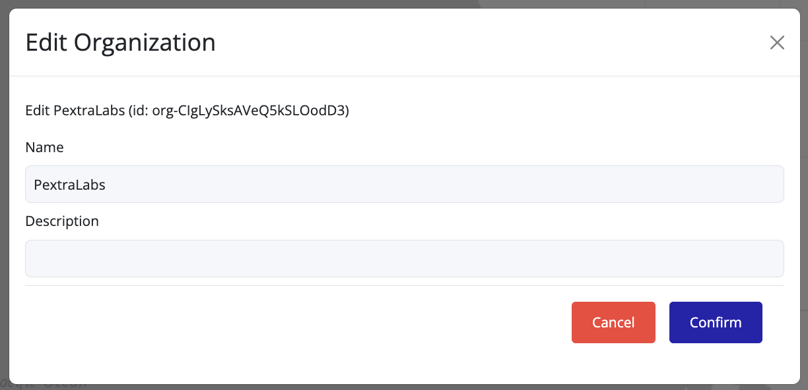
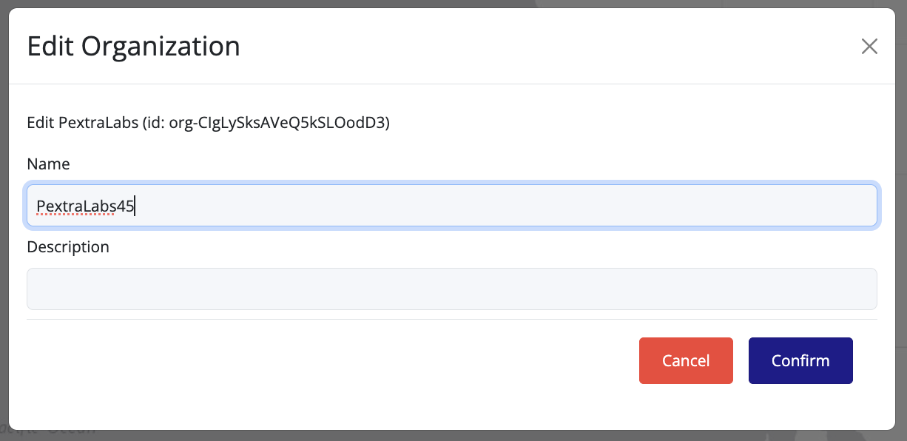
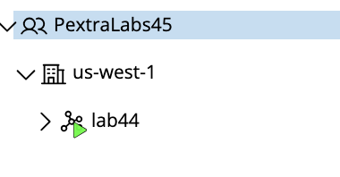

## Editing an Organization

You can update an organization’s **name** or **description** from the UI:

1. In the **left navigation panel**, right-click on the organization you want to edit.
2. Select **Edit** from the context menu.

3. Update the **Name** and/or **Description** fields as needed.

4. Click **Confirm** to save the changes.

  
