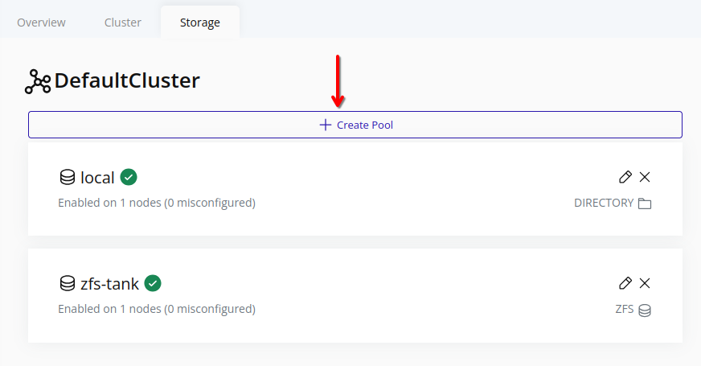
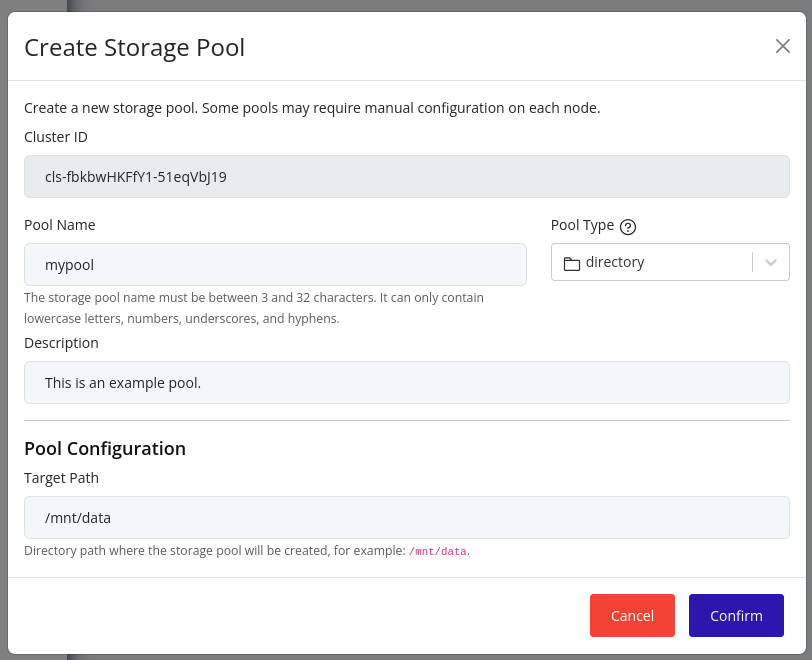

# Create Storage Pool

## Web Interface
1. Select the cluster in the resource tree and view the page on the right. Click on the **Storage** tab in the right pane.
   

2. Click the **Create Pool** button.
   

3. Choose the [storage pool type](./index.md#storage-pool-types), enter a name, and enter the required configuration metadata.
   

4. Click **Create** to create the storage pool. Initially, the new storage pool will not be enabled on any nodes. To enable the new storage pool on nodes, refer to the [Edit Storage Pool](./edit.md) section.