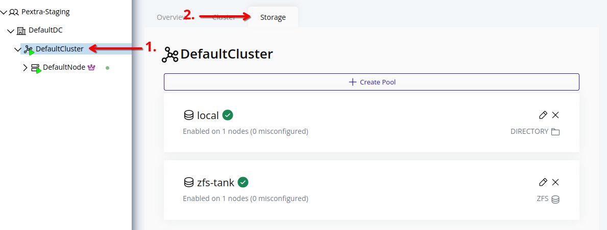
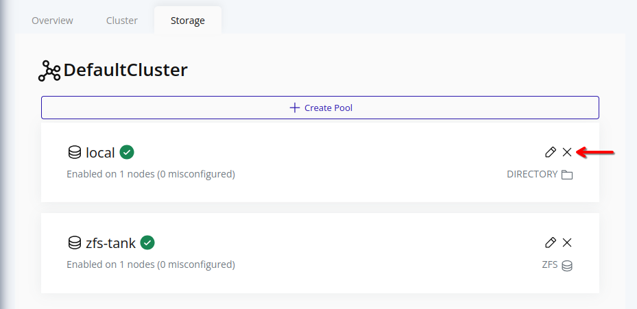
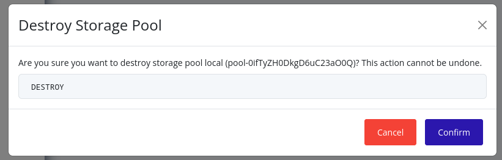

# Destroy Storage Pool
> [!NOTE]
> Storage pools cannot be destroyed if there are volumes on enabled nodes. All volumes must be destroyed, or all enabled nodes with volumes [must have their associations removed](./edit.md). This limitation will be addressed in the future.

## Web Interface
1. Select the cluster in the resource tree and view the page on the right. Click on the **Storage** tab in the right pane.
   

2. Click on the X icon in the card of the storage pool you want to destroy.
   

3. A confirmation dialog will appear. Type in "DESTROY" and click **Confirm** to confirm the destruction of the storage pool.
   

4. The storage pool will be marked for destruction, and will be cleaned up according to the [storage pool propagation algorithm](./propagation.md). This may take some time. During this time, the storage pool's name will be unavailable for reuse.
