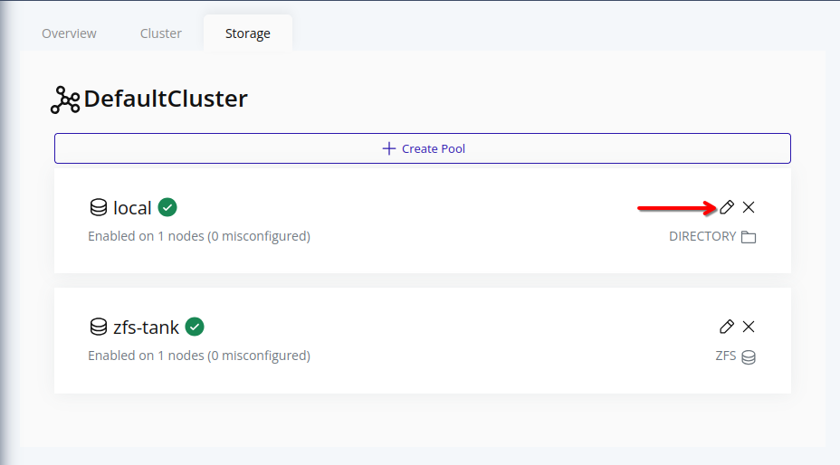
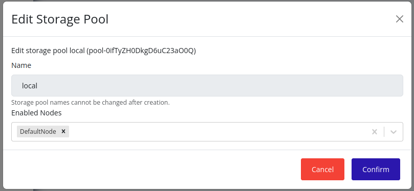

# Edit Storage Pool
Currently, only node associations with storage pools can be modified. The name of a storage pool cannot be changed after creation.

## Web Interface
1. Select the cluster in the resource tree and view the page on the right. Click on the **Storage** tab in the right pane.
   

2. Click on the pencil icon in the card of the storage pool you want to edit.
   

3. In the edit form, you can select the nodes on which this storage pool should be enabled. The nodes that are already associated with this storage pool will be selected by default.
   

4. Click **Save** to apply the changes. The storage pool will be enabled on the selected nodes, and the changes will be propagated according to the [storage pool propagation algorithm](./propagation.md). This may take some time.
