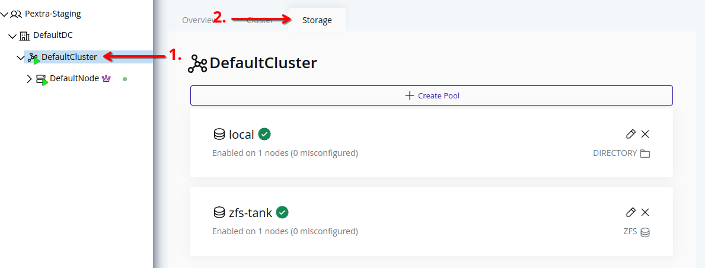

# List Storage Pools
Storage pools can be listed to view the current storage configuration in the cluster. This includes details about the storage pools, their status, and the nodes they are associated with.

## Web Interface
1. Select the cluster in the resource tree and view the page on the right. Click on the **Storage** tab in the right pane. The storage pools will be listed:
   

To edit associated nodes of a storage pool, refer to the [Edit Storage Pool](./edit.md) section.

### Storage Pool Status
Each storage pool has a status indicator that provides information about its availability and configuration across the nodes in the cluster. The status can be one of the following:

 The storage pool has not been enabled on any nodes.

 The storage pool is available on all enabled nodes.

 An error has occurred while propagating the storage pool configuration to enabled nodes. Manual intervention may be required to resolve the issue.