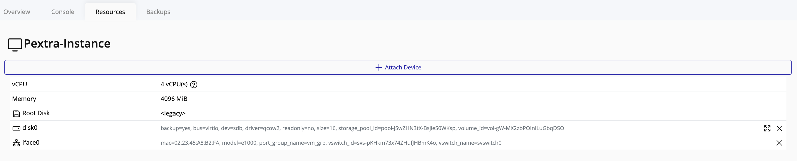
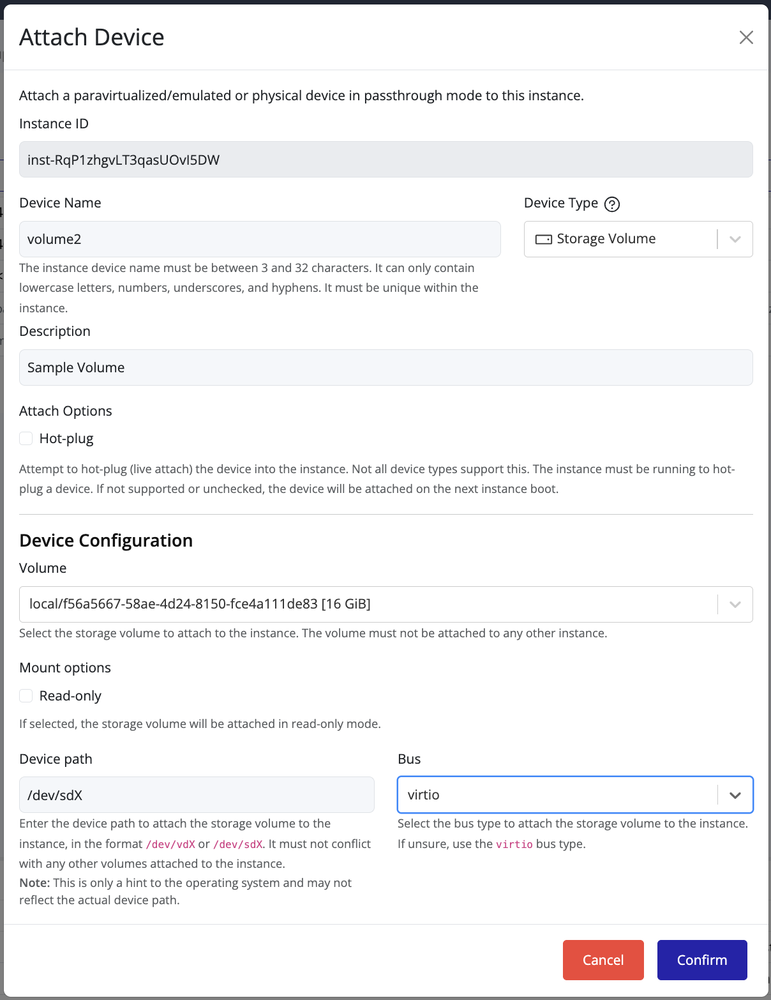

## Attaching a Volume to an Instance

You can attach a storage volume to an existing instance to expand its storage or provide additional data access.

### Steps to Attach a Volume

1. In the **left navigation panel**, click on the **instance** you want to attach the volume to.

   

2. On the **right-hand panel**, click the **Resources** tab.
3. Click **Attach Device**.
4. Fill in the required information:
    - **Device Name:** Enter a name for the device (3–32 characters, no spaces).
    - **Device Type:** Select **Storage Volume**.
    - **Volume:** Choose the volume you want to attach (only unattached volumes are available).
    - **Device Path:** Enter the path for the device (e.g., `/dev/sdc`).
    - **Bus Type:** Select a bus type (e.g., `virtio`).
5. Click **Confirm**.

Once confirmed, the volume will be attached to the instance and available for use.  

