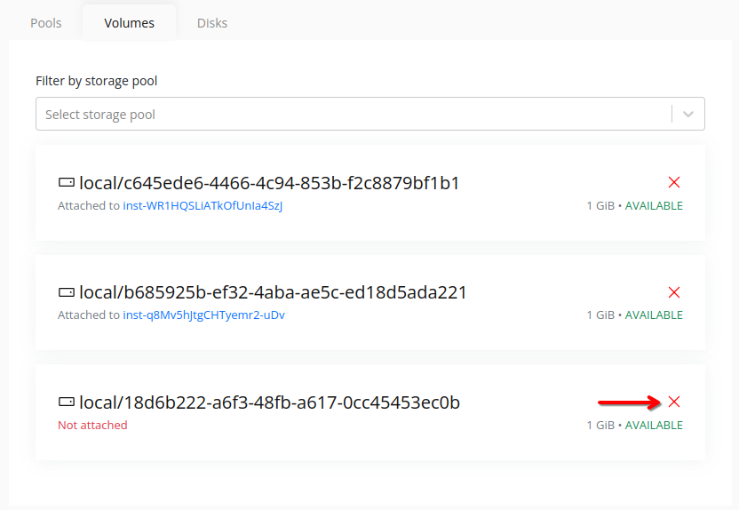
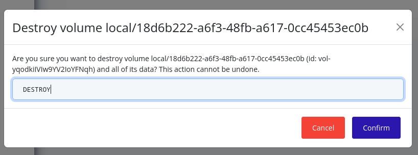

# Destroy Volume
> [!NOTE]
> A volume cannot be destroyed if it is attached to an instance. You must first detach the volume from the instance before destroying it.

## Web Interface
1. Select the node in the resource tree and view the page on the right. Click on the **Storage** tab in the right pane.
   

2. Click on the **Volumes** tab to view the list of volumes associated with the node.

3. Click on the X icon next to the volume you want to destroy.
   

4. In the confirmation dialog, type "DESTROY" and click **Confirm** to confirm the destruction of the volume.
   

5. The volume will be destroyed, and it will no longer be available in the list of volumes.

> [!NOTE]
> If the volume was attached to an instance, you may need to restart the instance to ensure it no longer references the destroyed volume.