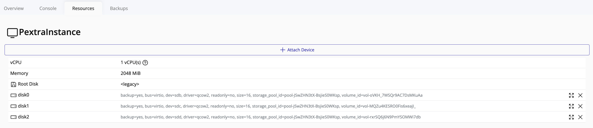
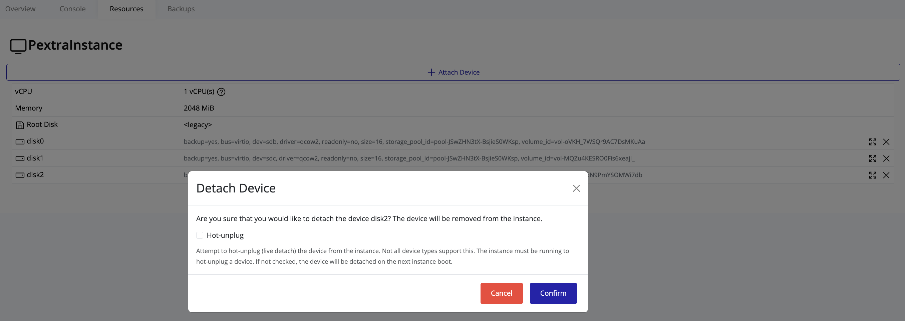

## Detaching a Volume from an Instance

### Steps to Detach a Volume

1. In the **left navigation panel**, click on the **instance** that has multiple volumes attached.
2. On the **right-hand panel**, click the **Resources** tab.
3. In the **Resources** section, scroll to the list of attached volumes.  
   
4. To detach a volume, click the **Delete** button in the row of the desired volume.
5. A confirmation popup will appear. Enter the required confirmation string as prompted and click **Confirm**.  
   

Once confirmed, the selected volume will be detached from the instance and will become available to attach to other instances if needed.

> [!Tip]
> You **cannot detach the root volume** of an instance.

> [!Tip]
> Detaching a volume **does not delete it**; it is simply removed from the instance. To view all volumes—both attached and detached—click on the **node** in the left navigation panel, then go to the **Storage** tab and select **Volumes**.

