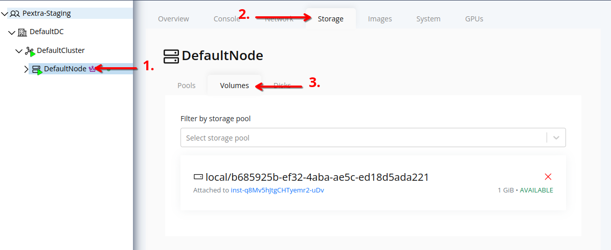
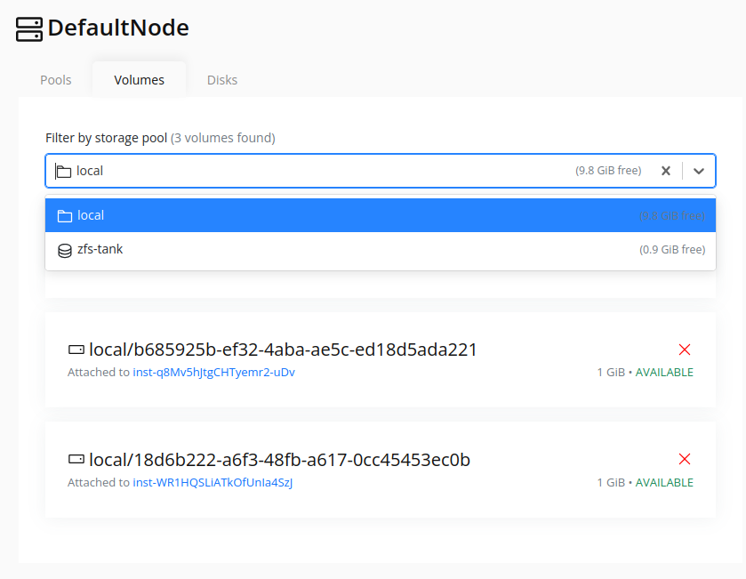

# List Volumes
## Web Interface
1. Select the node in the resource tree and view the page on the right. Click on the **Storage** tab in the right pane.
   

2. Click on the **Volumes** tab to view the list of volumes associated with the node.

3. The list displays all volumes associated with the node. To filter by storage pool, use the **Storage Pool** dropdown at the top of the list.
   