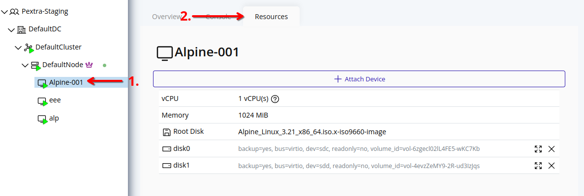
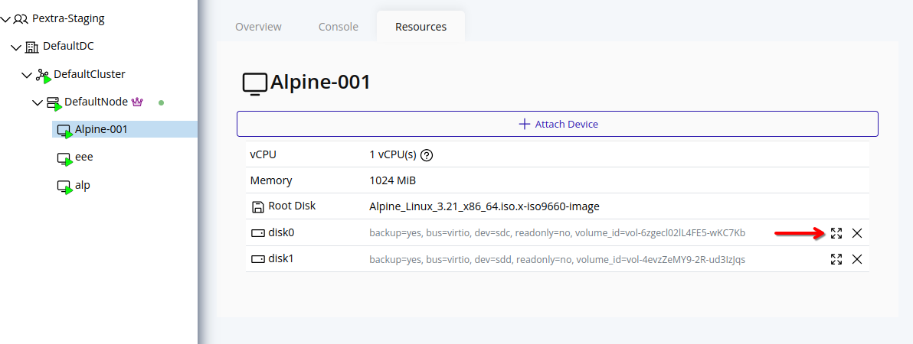
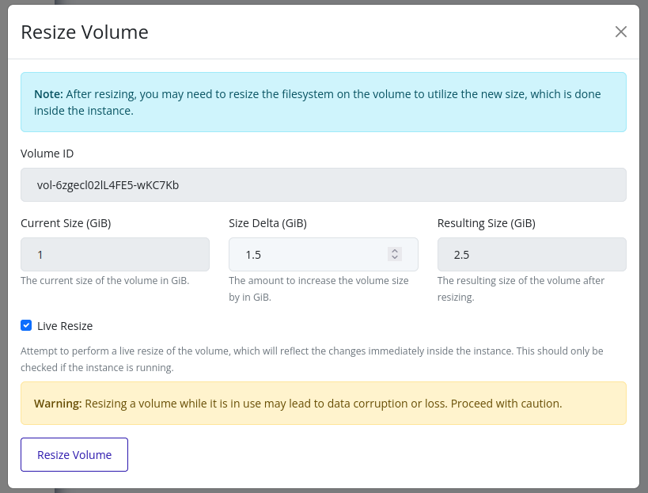
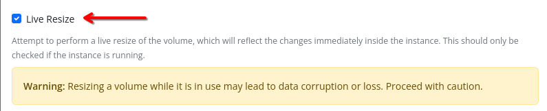

# Resize Volume
> [!WARNING]
> Resizing a volume while it is in use may lead to data corruption or loss. Proceed with caution.

> [!NOTE]
> After resizing, you may need to resize the filesystem on the volume to utilize the new size, which must be done inside the instance.

## Web Interface
Currently, volumes can only be resized through the **Resources** tab in the instance details page. This will change in the future.

1. Select the instance in the resource tree and view the page on the right. Click on the **Resources** tab in the right pane.
   

2. Click on the resize icon next to the volume you want to resize.
   

3. In the resize form, enter the delta size in GiB. This value will be added to the current size of the volume.
   

4. If the instance is running, the **Live Resize** option will be checked. This allows the volume to be resized without stopping the instance.
   

5. Click **Resize Volume** to apply the changes. The volume will be resized according to the specified delta size.

> [!TIP]
> To perform a *cold resize*, you can stop the instance first, then follow the same steps as above without selecting the **Live Resize** option. This will ensure that the volume is resized safely without any risk of data corruption.