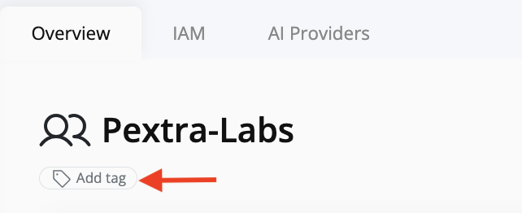
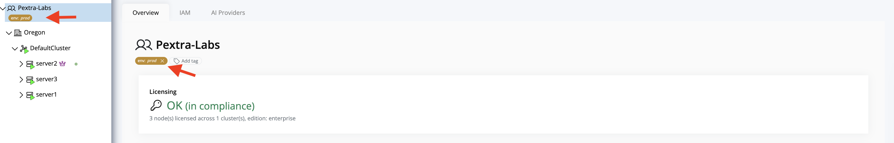

# Add a Tag

Tags in Pextra CloudEnvironment® allow you to organize and manage resources using **key-value pairs**. This section explains how to add a tag to a resource.

## Steps to Add a Tag

1. Navigate to the **resource** you want to tag.
2. Click the **Add Tag** button located under the resource.

3. An editable box will appear for entering the **key** and **value** of the tag.  
   You can cancel by clicking the **"X"** icon.

4. Once you have entered the key and value, click the **check mark** to save the tag.

5. Saved tags will be displayed with **color-coded visual differentiation**.

> [!TIP]
> Use tags thoughtfully. You can assign multiple tags to the same resource, but avoid clutter to maintain clarity and ease of management.
