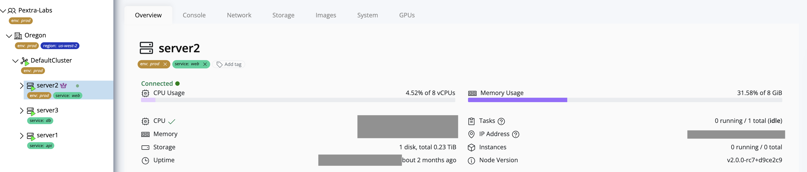

# Tags

Tags in Pextra CloudEnvironment® are **key-value pairs** that can be applied to resources to **organize, categorize, and manage** them effectively. Tags help identify resources, group related assets, and enable filtering, reporting, or automation based on tag values.

## Taggable Resources

You can assign tags to most resources in Pextra CloudEnvironment®, including:

- **Organizations**
- **Data Centers**
- **Clusters**
- **Nodes**
- **Instances**

> [!TIP]  
> Use consistent naming conventions for tags to maintain clarity and simplify management. For example, `Environment=Production` or `Project=Alpha` can help you easily filter and organize resources.
