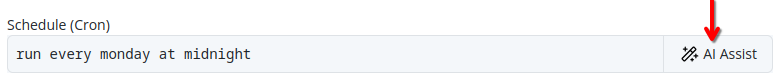
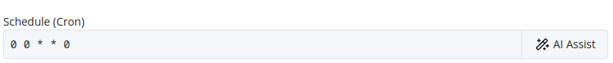

# AI Assist
Throughout the Pextra CloudEnvironment® web interface, you will find the **AI Assist** button, which provides context-sensitive suggestions and assistance. Describe your task in natural language, and the AI Assist feature will generate relevant suggestions to facilitate your work[^1].

See the example below for a demonstration of how to use the AI Assist feature.

*Before*:

*After*:

An administrator of the organization [must configure at least one AI provider](../organizations/ai-providers/add.md) for the AI Assist feature to function. If no AI providers are configured, the AI Assist feature will not be available in the web interface.

## Notes

[^1]: The AI Assist feature is powered by third-party AI providers, as configured in your organization settings. The quality and accuracy of the suggestions may vary based on the provider and the specific task at hand. Always review AI-generated suggestions before applying them to your environment.